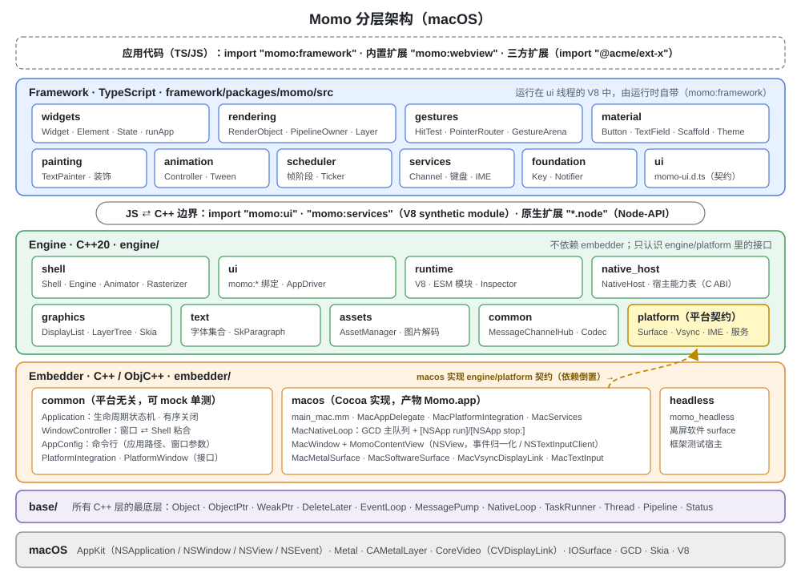
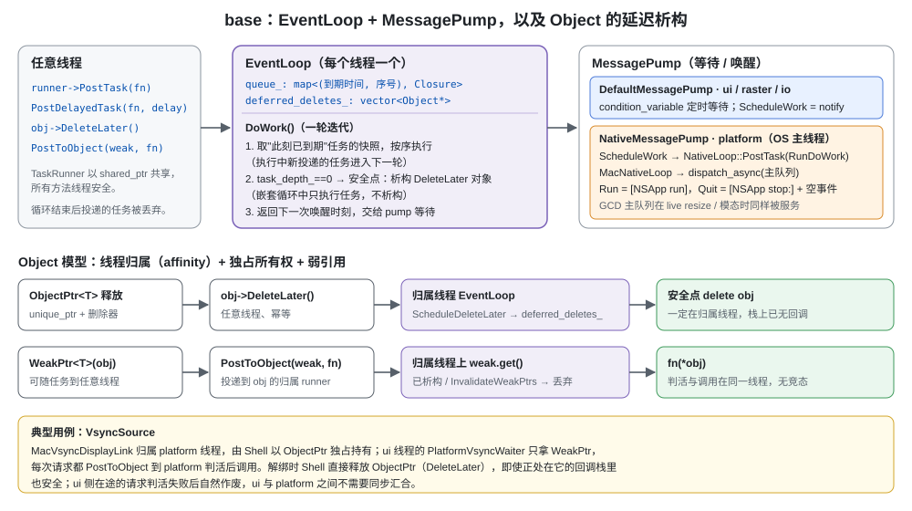
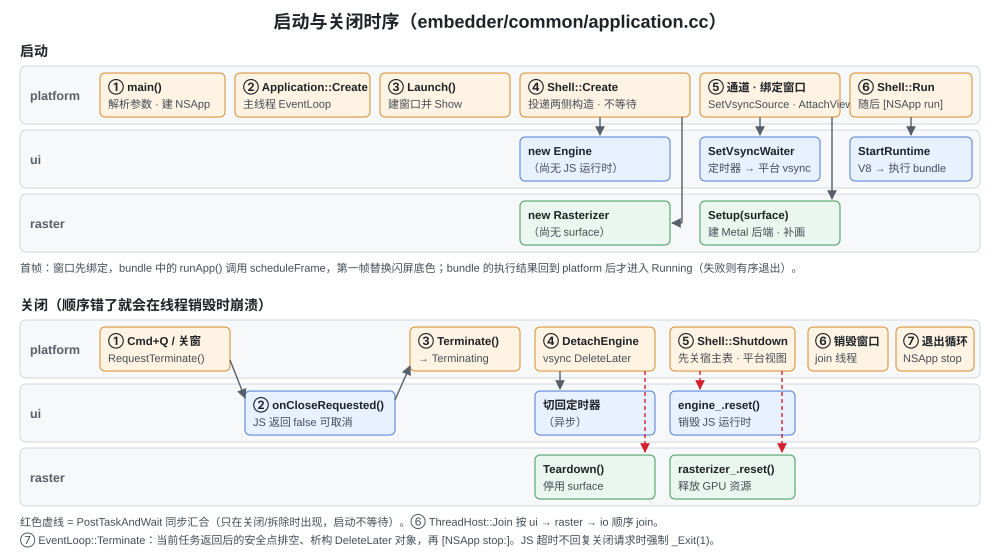
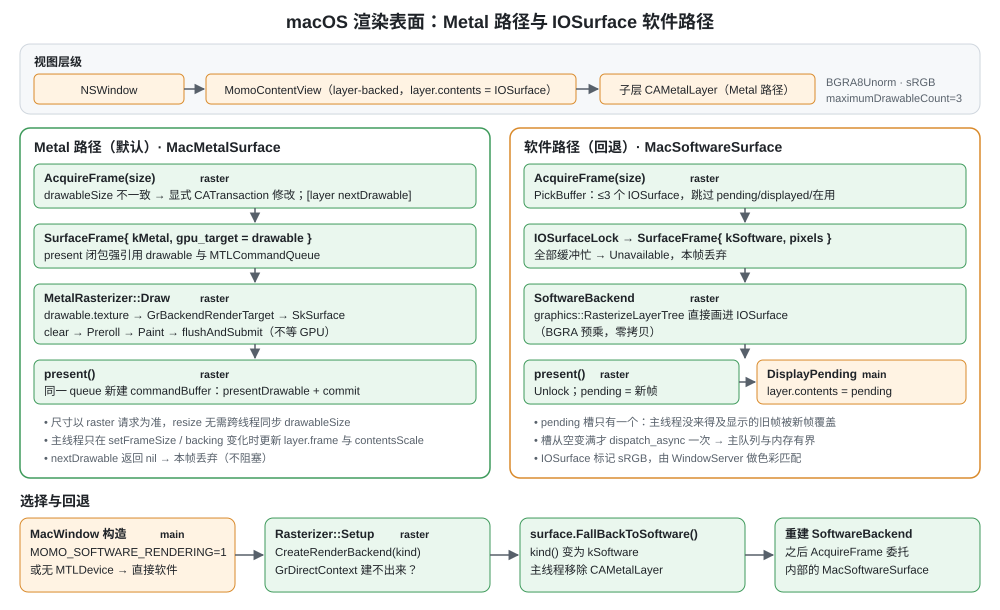
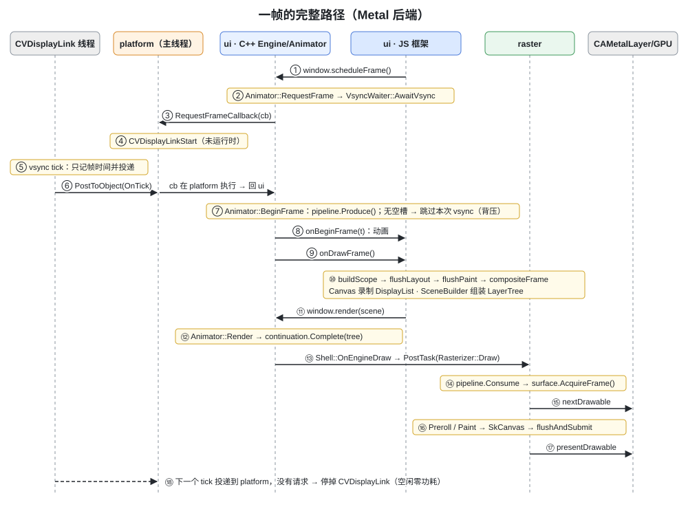

# Momo 架构与运行机制

本文从**实现**的角度说明 Momo 的模块划分，以及一个应用从进程启动、出帧、处理输入到退出的完整运行机制。
平台相关部分目前只写 **macOS**。Windows 平台层与 macOS 同构（对应关系见 [docs/03-platform.md](docs/03-platform.md) §6），但未在 Windows 上验证，见 [docs/11-roadmap.md](docs/11-roadmap.md)。

- 设计动机、取舍与规划写在 `docs/` 下的设计文档里（[docs/00-overview.md](docs/00-overview.md) 起）。本文只讲现在的代码怎么工作，每节末尾给出对应的设计文档。
- 接手维护的规则、阅读路线和常见改动步骤见 [ONBOARDING.md](ONBOARDING.md)。
- 文中的代码块都是**伪代码**：保留真实的类名、函数名和调用顺序，省略错误处理、断言和日志。真实实现以括号中标注的源文件为准。

## 目录

1. [总览](#1-总览)
2. [基础设施 base：对象、事件循环、线程](#2-基础设施-base对象事件循环线程)
3. [Embedder 层（macOS）](#3-embedder-层macos)
4. [Engine 层](#4-engine-层)
5. [Framework 层（TypeScript）](#5-framework-层typescript)
6. [端到端：一次点击到屏幕更新](#6-端到端一次点击到屏幕更新)
7. [构建产物与测试](#7-构建产物与测试)
8. [扩展与移植](#8-扩展与移植)

---

## 1. 总览

### 1.1 分层



| 层 | 语言 | 目录 | 一句话职责 |
|---|---|---|---|
| Framework | TypeScript | `framework/packages/momo/src` | View/Element/RenderObject 三棵树、布局、绘制组织、手势、动画、Material 控件;应用(`app`)与原生窗口(`Widget`)对象。运行在引擎内嵌的 V8 中;由运行时自带,应用以 `import "momo:framework"` 使用(§4.6) |
| Engine | C++20 | `engine/` | V8 运行时与 `momo:*` 绑定、帧调度、DisplayList/LayerTree、Skia 光栅化、文本排版、图片解码、原生扩展的宿主能力表 |
| Embedder | C++ / Objective-C++ | `embedder/` | 可执行程序本身：进程入口、原生消息循环、窗口、渲染表面、VSync、输入/IME，并负责装配与驱动 Engine |
| base | C++20 | `base/` | 全项目基础库：`Object`（线程归属 + 延迟析构）、`EventLoop`、`TaskRunner`、`Pipeline`、`Status` |

依赖方向由 CMake 保证（不提供反向链接）：

```
应用 (JS) ── import "momo:framework"、内置扩展 "momo:webview"（运行时自带的 JS 模块）
framework (JS) ── 只通过 import "momo:ui" / "momo:services" 与 engine 交互
embedder ──► engine（含 engine/platform 契约）──► base
   └──────────────────────────────────────────► base
```

**依赖倒置**是整个分层最关键的一点：engine 需要宿主提供的能力（渲染表面、VSync、输入事件……）以**纯虚接口**的形式声明在 `engine/platform/` 里，接口归使用方 engine 所有。embedder 实现这些接口，再把实例注入给 engine。因此：

- engine 不 include 任何 `embedder/` 头文件，可以脱离真实窗口做 headless 测试；
- 移植新平台 = 在 `embedder/<os>/` 实现这组接口，再写一个入口。

**engine 只认识视图**：一个视图的画面、尺寸、输入、焦点与输入归属（捕获）。窗口的外观与行为（标题、光标、位置、标题栏、拖动、创建与关闭的询问）、菜单与托盘、剪贴板、打开 URL、输入法都属于宿主——它们不出现在 engine 的任何接口里，而是由 embedder 在引擎的消息通道上注册处理器（`momo/window`、`momo/app`、`momo/menu`、`momo/tray`、`momo/clipboard`、`momo/url`、`momo/textinput`），JS 与宿主直接往返（§3.10）。这与 Flutter（engine 只有 view，窗口由 embedder/插件经 platform channel 处理）和 Chromium（cc/content 不关心窗口边框，窗口归 `views::Widget` ⇄ `NativeWidget`）的分工一致。新增窗口能力或平台服务只改 embedder 与框架，不改 engine。

### 1.2 运行时对象图

一个运行中的 Momo 进程里主要有这些对象（括号内是**归属线程**，即对象只能在这个线程上使用和析构）：

```
main()                                         embedder/macos/main_mac.mm
└─ embedder::Application              (platform)  进程生命周期状态机与退出流程(Quit / Exit);不决定窗口
   ├─ PlatformIntegration (Mac)       (platform)  工厂：窗口、VSync、服务、应用能力(PlatformApp)、菜单与托盘、显示器、原生循环
   │   ├─ MacMouseInput               (platform)  进程内唯一的指针输入:PointerDispatcher + 序列监视器(注入每个 MacWindow)
   │   └─ MacMenus                    (platform)  应用菜单(NSApp.mainMenu)、上下文菜单、托盘图标(MacTray)
   ├─ EventLoop  + NativeMessagePump  (platform)  跑在 [NSApp run] 之上
   ├─ engine::ThreadHost                          创建并 join ui / raster / io 三个线程
   ├─ WindowManager                   (platform)  窗口注册表:创建、关闭询问、焦点/IME 路由(视图 0 = 启动窗口)
   │   └─ 视图 id → WindowController  (platform)  窗口 ⇄ Shell 视图的粘合层
   │       └─ MacWindow               (platform)  MomoWindow/MomoPanel + MomoContentView
   │           ├─ MacMetalSurface / MacSoftwareSurface   (由 raster 线程使用)
   │           └─ MacTextInput        (platform)
   ├─ AppChannel                      (platform)  宿主通道 momo/app(§3.10)
   ├─ WindowChannel                   (platform)  宿主通道 momo/window(§3.10)
   ├─ PlatformChannels                (platform)  宿主通道 momo/clipboard、momo/url、momo/textinput
   ├─ MenuChannel / TrayChannel       (platform)  宿主通道 momo/menu、momo/tray(§3.10"菜单与托盘")
   └─ engine::Shell                   (platform)  引擎实例的协调中枢
       ├─ MessageChannelHub           (任意线程)  异步消息通道
       ├─ NativeHost               (platform)  原生扩展的宿主能力表
       ├─ ObjectPtr<MacVsyncDisplayLink> (platform)
       ├─ Engine                      (ui)
       │   ├─ Animator → VsyncWaiter  (ui)        帧调度与背压
       │   └─ AppDriver = JsAppDriver (ui)
       │       ├─ JsRuntime (Node.js 环境: libuv 循环 + V8 Isolate + Context;NodeBindings → uv poll 线程)
       │       └─ UiBindings (momo:ui / momo:services)
       └─ Rasterizer                  (raster)
           └─ RenderBackend (Metal / Software)
```

### 1.3 线程模型


与 Flutter 相同的四个 TaskRunner。每个线程都运行同一种 `momo::EventLoop`，区别只在 `MessagePump`（见 §2.2）。规则：

- **V8 只在 ui 线程**。所有 JS 对象都不跨线程，数据以字节或 POD 复制出入。
- **GPU 上下文只在 raster 线程**，绝不调用 JS。
- **平台 API 只在 platform 线程**（macOS 的主线程）。
- 跨线程只靠**投递任务** + **不可变数据**（`DisplayList`、`LayerTree` 以 `shared_ptr` 共享）。帧路径上没有阻塞等待；`PostTaskAndWait` 只在启动和关闭时出现。
- **回调一律在调用方线程执行。** A 线程把回调交给某个 API，这个回调就只会在 A 线程上被调用；唯一的例外是注册时以 runner 参数显式指定了执行线程（如 `MessageChannelHub::SetNativeHandler`）。系统线程（CVDisplayLink、DwmFlush、uv poll 线程、inspector IO 线程）和扩展自己的线程只负责投递，从不直接调用别人的回调。
- `RenderSurface` 是唯一的例外：它归窗口所有（platform），却被 raster 线程使用。所以解绑时 `Shell::DetachView` 必须与 raster 同步汇合，之后窗口才能销毁。

设计文档：[docs/00-overview.md](docs/00-overview.md)、[docs/08-threading-model.md](docs/08-threading-model.md)。

---

## 2. 基础设施 base：对象、事件循环、线程

`base/` 是所有 C++ 层的底座。engine 和 embedder 里不出现裸的 `std::thread` / `std::mutex` / `condition_variable`，需要时先在 base 中提炼成通用设施。



### 2.1 Object：线程归属 + 延迟析构

有线程归属的类都继承 `momo::Object`（`base/object.h`），例如 `Application`、`Shell`、`Engine`、`Animator`、`VsyncWaiter`、`Rasterizer`、`MacVsyncDisplayLink`。

| 概念 | 语义 |
|---|---|
| 归属（affinity） | 构造时绑定当前线程的 `EventLoop`（或显式传入 runner）。方法只在归属线程调用，debug 构建由 `MOMO_DCHECK_ON_AFFINITY_THREAD()` 断言 |
| `ObjectPtr<T>` | 独占所有权；释放时**不立即 delete**，而是 `DeleteLater()` |
| `DeleteLater()` | 任意线程可调用、幂等；对象在归属线程 EventLoop 的下一个**安全点**析构 |
| `WeakPtr<T>` | 项目内唯一的弱引用；可以随任务到任意线程，只能在归属线程解引用 |
| `PostToObject(weak, fn)` | 投递到对象的归属线程，判活后调用 `fn(*obj)` |

不用 `shared_ptr` 表达跨线程生命周期。这样做的好处是：析构永远发生在正确的线程，并且对象可以在自己的回调栈里被"删除"（析构推迟到栈展开之后）。

```cpp
// 伪代码：PostToObject（base/object.h）
template <class T, class Fn>
void PostToObject(WeakPtr<T> weak, Fn fn) {
  weak.task_runner()->PostTask([weak, fn] {
    if (T* obj = weak.get())   // 在归属线程上判活：判活与调用之间不会被析构
      fn(*obj);
  });
}
```

### 2.2 EventLoop 与 MessagePump

`EventLoop`（`base/event_loop.{h,cc}`）负责任务调度和延迟析构，等待/唤醒交给可替换的 `MessagePump`：

| 线程 | pump | 创建者 |
|---|---|---|
| ui / raster / io | `DefaultMessagePump`（条件变量定时等待） | `engine::ThreadHost` → `momo::Thread` |
| platform（OS 主线程） | `NativeMessagePump(platform.native_loop())` | `embedder::Application::Create` |
| 测试 | 不跑 pump，`RunUntilIdle()` 手动驱动 | `testing::ScopedTestEventLoop` |

```cpp
// 伪代码：EventLoop 一轮迭代（base/event_loop.cc）
TimePoint EventLoop::DoWork() {
  // 1. 只取"此刻已到期"任务的快照；执行期间新投递的任务进入下一轮，自我重投的任务不会饿死别人
  auto batch = TakeDueTasks(Clock::now());        // 按 (到期时间, 投递序号) 排序
  for (auto& task : batch) { ++task_depth_; task(); --task_depth_; }

  // 2. 安全点：栈上没有任务时才析构 DeleteLater 对象。
  //    原生嵌套循环（任务里弹模态框、窗口 live resize）会重入 DoWork，此时 depth > 0，只执行任务不析构
  if (task_depth_ == 0) ProcessDeferredDeletes();

  // 3. 返回下一次唤醒时刻，由 pump 负责等待
  return NextWake();
}
```

结束语义（`Terminate()`，任意线程、幂等）：在它之前已到期的任务全部执行，其余丢弃；然后**反复清理 DeleteLater 队列直到为空**，保证每个被标记的对象都在本线程析构。

### 2.3 平台主线程：EventLoop 跑在 NSApplication 之上

macOS 的主线程必须由 `[NSApp run]` 驱动，所以 platform 线程的 EventLoop 不能自己阻塞等待，而是把"执行一轮 DoWork"投递成原生任务。`NativeLoop`（接口在 `base/native_loop.h`）由平台实现：

```objc
// 伪代码：MacNativeLoop（embedder/macos/mac_native_loop.mm）
void PostTask(Closure task)         { dispatch_async(dispatch_get_main_queue(), ^{ task(); }); }
void PostDelayedTask(Closure t, d)  { dispatch_after(now + d, dispatch_get_main_queue(), ^{ t(); }); }
bool RunsTasksOnCurrentThread()     { return pthread_main_np(); }
void Run()                          { [NSApp run]; }
void Quit() {
  [NSApp stop:nil];
  [NSApp postEvent:<空的 ApplicationDefined 事件> atStart:NO];   // stop 要等处理完下一个事件才生效
}
```

```cpp
// 伪代码：NativeMessagePump（base/native_message_pump.cc）
void ScheduleWork() { native_.PostTask([state] { RunDoWork(state); }); }

void RunDoWork(state) {
  TimePoint next = state->delegate->DoWork();          // delegate 即 EventLoop
  if (next == TimePoint::max()) return;                // 没有待办
  if (next <= now) native_.PostTask(RunDoWork);        // 还有已到期任务：再投一轮
  else ScheduleDelayed(next);                          // 只保留最早的一次在途 dispatch_after
}
```

GCD 主队列由主 CFRunLoop 在 common modes 下服务，所以窗口拖拽缩放（live resize）和模态对话框期间，platform 线程上的任务照常执行。live resize 时主线程还会在 `setFrameSize:` 里同步等待一帧新尺寸的内容（docs/05 §4 resize），等待期间用 `EventLoop::RunDueTasksNested()` 执行平台任务——它和原生嵌套循环一样只执行任务、不析构。

### 2.4 其他设施

| 设施 | 文件 | 用途 |
|---|---|---|
| `Thread` | `base/thread.h` | 具名线程，自带 EventLoop；默认 8 MiB 栈（macOS 次线程默认 512 KiB，容不下 V8 的栈上限） |
| `Pipeline<T>` | `base/pipeline.h` | 固定深度生产/消费管道，实现帧背压（§4.3） |
| `PostTaskAndWait` / `PostTaskAndReplyWithResult` | `base/task_util.h` | 启动/关闭汇合点；"在 A 线程做事、回 B 线程汇报" |
| `WaitableEvent` | `base/waitable_event.h` | 关闭与拆除时的同步汇合（`PostTaskAndWait` 的实现；启动路径不等待） |
| `Status` / `StatusOr<T>` | `base/status.h` | 全项目禁用异常，可失败操作返回 `StatusOr` |

设计文档：[docs/12-base.md](docs/12-base.md)、[docs/08-threading-model.md](docs/08-threading-model.md)。

---

## 3. Embedder 层（macOS）

### 3.1 模块划分

| 目录 | 内容 | 能否单测 |
|---|---|---|
| `embedder/common/` | 平台无关的装配逻辑：`Application`（生命周期状态机、有序关闭）、`WindowController`（窗口 ⇄ Shell）、`AppConfig`（命令行：应用路径与窗口参数）；embedder 自己的平台抽象 `PlatformIntegration`、`PlatformWindow`、`WindowDelegate`、`DisplayInfo` | 能，用 `common/testing/mock_platform.h` |
| `embedder/macos/` | Cocoa 实现与入口，见下表 | `momo_embedder_macos_unittests` |
| `embedder/headless/` | `momo_headless`：无窗口宿主，离屏软件 surface；框架 TS 测试的引擎侧运行器 | — |

两组接口要分清：

- **engine 的平台契约**（`engine/platform/`，`momo::engine::platform`）：`RenderSurface`、`VsyncSource`、`PointerData`/`KeyData`、`ViewportMetrics`、`ViewId`、平台视图的合成布局。engine 只认识这些。
- **embedder 的平台抽象**（`embedder/common/`）：`PlatformIntegration`、`PlatformWindow`（含可选的窗口能力，见 §3.10）、`PlatformServices`、`TextInputConnection`、窗口类型（`SystemCursor`、`WindowOptions`、`TitleBarOptions`…）。只有 embedder 使用，engine 看不到。它的作用是让 `embedder/common` 本身也平台无关、可 mock，并让窗口与平台服务的能力只在 embedder 里扩展。

macOS 实现（`embedder/macos/`）：

| 文件 | 实现的接口 | 要点 |
|---|---|---|
| `main_mac.mm` | — | 进程入口，只做翻译（<100 行） |
| `mac_app_delegate.mm` | `NSApplicationDelegate` | 退出拦截、隐藏/显示 → 生命周期 |
| `mac_menu.mm` / `mac_tray.mm` | `PlatformMenus`、`PlatformTray`（embedder 抽象） | `MenuModel` → `NSMenu`（应用菜单原地更新、上下文菜单）；role = AppKit 标准 action（沿响应链）；`NSStatusItem` 托盘 |
| `mac_platform_integration.mm` | `PlatformIntegration`、`PlatformApp`、`PlatformServices`（embedder 抽象） | 工厂；应用隐藏/激活（NSApp）；剪贴板（NSPasteboard）、打开 URL（NSWorkspace）；`NSScreen` → `DisplayInfo`（主屏左上原点）；持有进程内唯一的 `MacMouseInput` 并注入每个窗口 |
| `mac_native_loop.mm` | `NativeLoop` | GCD 主队列 + `[NSApp run]` / `[NSApp stop:]` |
| `mac_window.mm` | `PlatformWindow`、`PointerWindow` | `MomoWindow`（NSWindow）/ `MomoPanel`（NSPanel，非激活面板）只把 `-sendEvent:` 转给 `MacWindow::SendEvent`；`MomoContentView`（自定义 `NSView`，first responder，键盘、`NSTextInputClient`、光标）；全部可选窗口能力（隐藏标题栏、系统拖动、移动循环、指针捕获…） |
| `mac_mouse_events.mm` | — | `MacMouseInput`：持有 `PointerDispatcher`，`NSEvent` → `PointerInput`；进程级本地监视器接住序列期间不属于任何 momo 窗口的事件；跟踪区工具、屏幕坐标换算 |
| `mac_platform_views.mm` / `mac_platform_view_input.mm` | — | 平台视图宿主（几何）/ 平台视图的输入投递（docs/05 §9） |
| `mac_surface_metal.mm` | `RenderSurface` | `CAMetalLayer`（挂在专用底层子视图 `MomoSurfaceBaseView` 里）；平台视图合成与拖拽缩放时经主线程呈现队列；可回退为软件 |
| `mac_surface_software.mm` | `RenderSurface` | 最多 3 个 IOSurface 轮换，设为 `layer.contents` |
| `mac_vsync_displaylink.mm` | `VsyncSource` | `CVDisplayLink`，按需启停 |
| `mac_text_input.mm` | `TextInputConnection`（embedder 抽象） | IME 状态与 `NSTextInputClient` 的同步查询 |
| `mac_key_mapping.mm` | — | 键盘事件 → `KeyData`：keyCode → USB HID usage 全表、逻辑键、修饰键（`flagsChanged`） |

### 3.2 启动流程



```objc
// 伪代码：进程入口（embedder/macos/main_mac.mm）
int main(argc, argv) {
  config   = AppConfig::Parse(args);                    // [<app>] --title --width --height --dev --inspect-port --inspect-brk
  platform = macos::CreateMacPlatformIntegration();     // [NSApplication sharedApplication]，ActivationPolicyRegular，
                                                        // 默认的应用菜单(MacMenus: 隐藏、退出)
  NSApp.delegate = [MacAppDelegate new];

  app = Application::Create({config, resources_dir = NSBundle.mainBundle.resourcePath}, platform);
  delegate.application = app;
  exit_code = app->Launch().ok() ? app->Run() : 1;      // Launch 不等 bundle 执行；Run() 内部就是 [NSApp run]
  return exit_code;                                      // 正常从 main 返回，不让 AppKit 直接 exit()
}
```

```cpp
// 伪代码：装配（embedder/common/application.cc）
Application::Create(options, platform) {
  require(platform->native_loop().RunsTasksOnCurrentThread());     // 必须在 OS 主线程
  loop = EventLoop::Create(make_unique<NativeMessagePump>(platform->native_loop()));
  loop->BindToCurrentThread();      // 之后主线程上创建的 Object 都归属它
  thread_host_  = ThreadHost("momo");                              // 起 momo.ui / momo.raster / momo.io
  task_runners_ = thread_host_->MakeTaskRunners(loop->GetTaskRunner());
}

Application::Launch() {
  TransitionTo(kLaunching);
  // 启动窗口(隐式视图 0;--no-startup-window 时不建)。WindowController 的事件交给 WindowManager:
  // 关闭按钮 → RequestCloseWindow(0)、状态(最小化/隐藏)→ 视图可见性、焦点/IME/屏幕框 → 宿主通道。
  if (config.startup_window) window_manager_->OpenStartupWindow();  // MacWindow:此时只有闪屏底色, 先显示
  LaunchEngine();                   // 返回时仍是 kLaunching: 主线程回到事件循环, 不等 bundle 执行
}

Application::OnRuntimeStarted(status) {   // Shell::Run 的结果, platform 线程
  if (!status.ok()) return Exit(1);       // bundle 加载/执行失败: 走退出流程, 退出码 1
  TransitionTo(kRunning);
}

Application::LaunchEngine() {
  settings = { 入口/assets 路径 ← engine::LocateApp(命令行的 <app> 或 <resources>/app),
               dev_mode, inspector,
               builtin_dir = <resources>/builtin（运行时自带的 JS 模块: 框架、内置扩展）,
               code_cache_dir = <入口给出的应用缓存目录>/v8（非 --dev）,
               refresh_rate = 主显示器刷新率（vsync 回退定时器用） };
  // 第一阶段: 只组装引擎(没有 JS 运行时, 不等待其他线程)
  shell_ = Shell::Create(task_runners_, settings,
      on_exit_requested = [](int code) { Exit(code); });   // JS process.exit(code), 见 §3.8
  // 宿主通道与窗口先就位(bundle 顶层代码就可能设置标题、打开窗口、退出;启动窗口在顶层即是视图 0)
  app_channel_       = AppChannel(shell_->hub(), platform runner, host = this);                // momo/app
  window_channel_    = WindowChannel(shell_->hub(), platform runner, host = window_manager_);  // momo/window
  platform_channels_ = PlatformChannels(shell_->hub(), ..., focused_text_input = WindowManager::FocusedTextInput);
  menu_channel_      = MenuChannel(shell_->hub(), platform runner, platform->menus(), host = this);  // momo/menu
  tray_channel_      = TrayChannel(shell_->hub(), platform runner, platform->menus());               // momo/tray
  window_manager_->AttachEngine(*shell_, ...);  // 应用唯一的 VsyncSource: CreateVsyncSource → Shell::SetVsyncSource;
                                                // 每个窗口: Shell::AttachView + 补发 metrics/焦点/可见性
  // 第二阶段: 异步启动 JS 运行时(ui 线程执行 bundle), 结果回到 platform 线程
  shell_->Run([](Status s) { OnRuntimeStarted(s); });
}
```

"合适的时机创建 JS 环境"在实现中的含义：窗口先 `Show()`（用户立刻看到原生窗口和闪屏底色），然后才创建 Shell；V8 初始化与 bundle 执行在 ui 线程进行，Rasterizer 初始化在 raster 线程**并行**进行，主线程不等它们——`Launch()` 返回后就进入消息循环（窗口可响应，`--inspect-brk` 等待调试器时也不卡主线程）。

应用的定位（`engine::LocateApp`，`engine/common/app_layout.h`）：应用路径是一个目录（入口是其 `package.json` 的 `main`，缺省 `index.js`；资源在 `<dir>/assets/`）或一个 JS 文件（它自己就是入口，资源在它旁边的 `assets/`）。命令行的第一个位置参数给出应用路径，缺省是应用包内的 `<Momo.app>/Contents/Resources/app`——打包后的应用与开发时走同一条路。目录里读不到 `package.json`、JSON 不合法、`main` 不是字符串时启动即报错。应用旁边的 `<resources>/builtin/` 是运行时自带的 JS 模块（框架与内置扩展，§4.6），应用的文件里没有它们。

### 3.3 生命周期

```
NotRunning → Launching → Running ⇄ Suspended → Terminating
   │            └────(启动失败)─────────────────────┘
   └──(未 Launch 即销毁)───────────────────────────┘
```

- **生命周期属于应用, 与窗口无关**。Suspended 只表示应用整体被隐藏（`applicationDidHide`）；没有窗口也是合法状态（JS、定时器、网络照常运行，只是不出帧）。最后一个窗口关闭不退出应用，只发 `momo/app windowAllClosed`，由 JS 决定（`app.quit()`）。
- 状态每次变化：(1) `Shell::SetAppSuspended`——引擎只需要知道是否出帧；(2) 经 `momo/app stateChanged` 通知 JS（框架的 `app.state` / `'state-changed'`）。应用的前台状态（`applicationDidBecomeActive/ResignActive`）经 `activeChanged`，点击 Dock 图标（`applicationShouldHandleReopen`）经 `activate`。
- **窗口可见性按视图**：窗口的显示/隐藏、最小化由 `WindowDelegate::OnWindowStateChanged` 上报，`WindowController` 把"可见 = 已显示且未最小化"交给 `Shell::OnViewVisibilityChanged`。引擎丢弃不可见视图的画面；只有应用挂起或没有可见视图时才停 Animator（重新可见时补一帧）。以 `show: false` 创建、尚未显示的窗口照常出帧：第一帧呈现后宿主发 `readyToShow`。

### 3.4 窗口与输入归一化

`MacWindow` 创建 `NSWindow` 和内容视图 `MomoContentView`。视图是 layer-backed 的、不透明、接受 first responder，并实现 `NSTextInputClient`。视图持有指向 `MacWindow` 的**非拥有**指针，`MacWindow` 析构时先调用 `[view detachOwner]` 清空它，之后到来的 AppKit 回调直接忽略。

键盘事件在 platform 线程归一化为平台无关的 `engine/platform/input_types.h` 类型，经 `WindowDelegate`（即 `WindowController`）转给 `Shell`。指针事件多一步：谁接收由进程内唯一的 `PointerDispatcher`（`embedder/common/pointer_dispatcher.h`，平台无关）决定——平台层只**翻译**原生事件、**执行**投递（中介者），按下序列、悬停、滚动锁定这些状态只在派发器里有一份（见 §3.10"指针派发"）：

```objc
// 伪代码：指针事件（embedder/macos/mac_window.mm、mac_mouse_events.mm）
void MacWindow::SendEvent(NSEvent* e, super) {         // MomoWindow / MomoPanel -sendEvent: 调用
  if (窗口装饰的按下序列) return super(e);                // 红绿灯、边缘缩放区的按下归 AppKit
  mouse_.Dispatch(e, this);                            // MacMouseInput：翻译为 PointerInput（类型、屏幕坐标、按键、
  ForwardToWindowChrome(e);                            // 滚动位移…；不做决定）→ PointerDispatcher 决定接收方
}                                                      // 装饰的跟踪区照常记账：进入/离开由输入流推导（红绿灯悬停）

// MacWindow 作为 PointerWindow 执行：
void MacWindow::SendToMomo(PointerDataPacket packet, const PointerInput&) {
  for (PointerData& d : packet) {                      // 屏幕坐标 → 本视图物理像素（左上原点）；滚动 点 → 像素
    NSPoint p = [view_ viewPointFromScreen:{d.screen_x, d.screen_y}];
    d.physical_x = p.x * scale; d.physical_y = (height - p.y) * scale;
  }
  delegate_->OnPointerPacket(packet);                  // → WindowController → Shell::OnPointerPacket → 投递 ui
}
void MacWindow::SendToPlatformView(int64_t view, const PointerInput& in, PointerPhase phase) {
  [input_router_ deliverEvent:(NSEvent*)in.native toPlatformView:view phase:phase ...];  // 经 AppKit 投递
}
```

滚动位移统一成"视口滚动方向"（AppKit 给的是内容移动方向），保留惯性阶段标记；普通滚轮按行换算为点。

键盘事件由 `mac_key_mapping` 翻译为 `KeyData{type, physical_key（USB HID usage）, logical_key, character, modifiers}`。几个 AppKit 特性要专门处理：

- 修饰键只有 `flagsChanged`，按下/抬起由修饰位判断；CapsLock 每次切换只有一个事件，合成一次完整的 down + up。
- 按住 Command 时，`-[NSApplication sendEvent:]` 会吞掉 `keyUp`，窗口和 first responder 都收不到。用 `NSEvent` 本地监视器补发，与 Flutter macOS embedder 的做法相同（子类化 `NSApplication` 也能解决，但要改 `NSPrincipalClass`，更侵入）。`keyUp:` 按 `NSEvent` 对象去重，万一 AppKit 也正常投递，只处理一次。
- 文本输入会话打开时，`keyDown` 在发出 `KeyData` 之后**再**交给 `interpretKeyEvents`（输入法）。同一按键是快捷键还是字符，由框架层判断。

窗口侧的变化由 `MomoWindowObserver`（`NSWindowDelegate`）上报：`windowDidResize` / `windowDidChangeBackingProperties` / `windowDidChangeScreen` → `OnMetricsChanged`；`windowDidBecomeKey` / `ResignKey` → 焦点；显示/隐藏、最小化、缩放、全屏 → `OnWindowStateChanged`；`windowShouldClose` → `OnCloseRequested`。

`WindowController` 是很薄的一层：把视图相关的事件（尺寸、输入、焦点、可见性）转发给 Shell；在引擎附着前缓存 metrics、焦点和可见性，附着时补发；纯通知类的窗口事件（状态、焦点、屏幕框、窗口控制按钮占用区域、首帧）直接经注入的 `WindowChannel` 通知 JS，需要 `WindowManager` 做决定的（关闭请求、焦点归属、IME 路由）经 `WindowController::Client` 接口交给它；平台窗口上报的是原始值，“与上次相同则不转发”的去重只在这里做一次；**总是拦截**原生关闭请求（返回 false），交给 `WindowManager::RequestCloseWindow` 异步询问 JS（§3.10）。

### 3.5 渲染表面



`RenderSurface`（`engine/platform/render_surface.h`）只有一个核心方法：在 raster 线程上 `AcquireFrame(physical_size)`，返回本帧的 `SurfaceFrame`（像素缓冲或 GPU 目标，外加一个 `present` 闭包）。

**Metal 路径（默认）**：`MacMetalSurface` 在内容视图最底层加一个专用子视图 `MomoSurfaceBaseView`，`CAMetalLayer`（BGRA8Unorm、sRGB、`framebufferOnly = NO`、最多 3 个 drawable）挂在它的 layer 上；平台视图宿主是其后加入的子视图，层级只由子视图顺序决定。下面是普通帧的路径；平台视图合成帧与拖拽缩放期间的帧改经主线程呈现队列，与平台视图几何、新窗口尺寸在同一个 `CATransaction` 里生效（docs/05）。

```objc
// 伪代码：raster 线程（embedder/macos/mac_surface_metal.mm）
StatusOr<SurfaceFrame> AcquireFrame(Size size) {
  if (software_) return software_surface_.AcquireFrame(size);       // 已回退
  if (layer_.drawableSize != size) {
    [CATransaction begin]; [CATransaction setDisableActions:YES];   // raster 线程没有 run loop：显式事务
    layer_.drawableSize = size;
    [CATransaction commit];
  }
  drawable = [layer_ nextDrawable];
  if (!drawable) return Unavailable;                                 // 本帧丢弃，不阻塞
  return { kMetal, gpu_target = drawable,
           present = [queue, drawable] {
             buf = [queue commandBuffer];                            // 与 Skia 的绘制命令同一个 queue，排在其后
             [buf presentDrawable:drawable]; [buf commit];
           } };
}
```

drawable 尺寸以 raster 线程本帧请求的尺寸为准，所以 resize 时不需要跨线程同步 `drawableSize`。主线程只在 `setFrameSize` / backing 变化时更新图层的 `frame` 和 `contentsScale`。

**软件路径（回退）**：`MacSoftwareSurface` 在 raster 线程直接把像素画进 IOSurface（零拷贝），由主线程设为 `layer.contents`。为了让主队列和内存有界，主线程最多挂起一帧：

```objc
// 伪代码（embedder/macos/mac_surface_software.mm）
AcquireFrame(size):                       // raster
  buf = PickBuffer(size)                  // 最多 3 个；跳过 pending、displayed 以及 IOSurfaceIsInUse 的
  if (!buf) return Unavailable            // 全忙：丢帧
  IOSurfaceLock(buf); return { kSoftware, pixels = base address, present = Present(buf) }

Present(buf):                             // raster
  IOSurfaceUnlock(buf)
  lock { if (pending) release(pending);   // 主线程还没显示的旧帧直接丢弃
         pending = retain(buf);
         schedule = !dispatch_scheduled; dispatch_scheduled = true; }
  if (schedule) dispatch_async(main, DisplayPending)     // 槽从空变满才投递一次

DisplayPending():                         // main
  surface = take(pending); layer.contents = surface; displayed = surface
```

**选择与回退**：

1. 平台集成启动时创建一次应用级的 Metal 设备与命令队列（`MacMetalDevice`），交给之后的每个窗口；环境变量 `MOMO_SOFTWARE_RENDERING=1` 或没有 Metal 设备 → 不创建，窗口直接用软件 surface。有设备时窗口的 surface 是 `FallbackSurface`（`embedder/common`）：Metal surface + 软件 surface 的组合。
2. raster 线程 `Rasterizer::Setup` 时：按 `surface.kind()` 创建后端；Metal 后端建不出来（例如 `GrDirectContext` 创建失败）→ 调 `surface.FallBackToSoftware()`：`FallbackSurface` 停用 Metal surface（`Deactivate`：主线程移除 `CAMetalLayer`），`kind()` 变为 `kSoftware`，之后的 `AcquireFrame` 转给软件 surface → Rasterizer 换用 `SoftwareBackend`。回退逻辑只在 `FallbackSurface` 里有一份，Windows 的 D3D surface 用的是同一个类（设备丢失经 `GpuSurface::device_lost()` 报告，同样由它回退）。
3. 全部窗口的 surface 报告同一个设备与队列，Rasterizer 据此让它们共用一个后端：整个应用一份 `GrDirectContext`。

### 3.6 VSync：按需启停的 CVDisplayLink

`VsyncSource::RequestFrameCallback(cb)` 是**一次性**请求：只在框架真正要出帧时请求，没有动画就不请求，空闲时 CVDisplayLink 也会停下（零功耗）。

按项目的回调规则（§1.3），`cb` 必须在调用方线程上执行，也就是 platform 线程。CVDisplayLink 自己的线程**从不调用 `cb`**，只记下帧时间并投递一次通知：

```cpp
// 伪代码（embedder/macos/mac_vsync_displaylink.mm）
// platform 线程
void RequestFrameCallback(Callback cb) {
  callback_ = cb;                                // 只在 platform 线程访问；新请求覆盖旧请求
  if (!running_) { CVDisplayLinkStart(link_); running_ = true; }
}

// CVDisplayLink 自己的高优先级线程：只投递，不回调
static CVReturn OnDisplayLink(..., now, output_time, ctx) {
  lock {
    if (destroyed) return;
    frame_start = HostTimeToTimePoint(now); frame_target = HostTimeToTimePoint(output_time);
    if (!tick_posted) { tick_posted = true; PostToObject(owner, &OnTick); }   // 合并多余的 tick
  }
}

// platform 线程
void OnTick() {
  lock { tick_posted = false; start, target = frame_start, frame_target; }
  if (!callback_) {                              // 空闲 tick：停掉 link（请求与停止都在本线程，无竞态）
    if (running_) { CVDisplayLinkStop(link_); running_ = false; }
    return;
  }
  cb = take(callback_);
  cb(start, target);                             // 在调用方线程执行
}
```

整个应用只有一个 `MacVsyncDisplayLink`（所有窗口共用一个 Animator）。它跟随 id 最小的窗口所在的显示器（视图 0 优先；`WindowManager` 在窗口打开/关闭时经 `PlatformIntegration::SetVsyncWindow` 重新指定，没有窗口时用主显示器）；这个窗口移到另一块屏幕（`NSWindowDidChangeScreenNotification`）时，`UpdateDisplay()` 切换 link 绑定的显示器。`MacVsyncDisplayLink` 是 platform 线程归属的 `Object`，由 `Shell` 以 `ObjectPtr` 持有，ui 线程只拿 `WeakPtr`（§4.3）。析构时先在锁内置 `destroyed`，再 `CVDisplayLinkStop`（它会等待在途回调返回）；已投递未执行的 `OnTick` 因 `WeakPtr` 失效而作废，所以析构后不会再有回调。Windows 的 `WinVsyncDwm` 用同样的模型（`DwmFlush` 线程只投递）。

### 3.7 IME

`MomoContentView` 实现 `NSTextInputClient`，把每个调用转给 `MacTextInput`（`TextInputConnection` 的实现）：

- **JS 是编辑模型的权威**：JS 经 `momo/textinput` 通道下发 `SetEditingState`（文本、选区、composing 区间，UTF-16 下标），覆盖本地状态。
- 两次同步之间，输入法事件先在本地**乐观应用**，保证 `hasMarkedText` / `markedRange` / `selectedRange` 这些同步查询立即反映最新的预编辑；同时翻译成 `TextInputEvent`（commit / composing 等），经 `WindowDelegate::OnTextInput` → `WindowController` → `PlatformChannels` 走 `momo/textinput` 通道发给 JS（不经过 Shell）。
- JS 上报的光标矩形（物理像素，相对内容区）用于 `firstRectForCharacterRange`，决定候选窗位置。

### 3.8 退出与有序关闭

退出有两种入口(同 Electron 的 `app.quit()` / `app.exit()`):

- `Application::Quit()`：Cmd+Q、菜单"退出"、JS `app.quit()`。可被 JS 取消。
- `Application::Exit(code)`：JS `app.exit(code)`、`process.exit(code)`。不询问，但仍有序关闭，退出码为 `code`。

关闭窗口按钮只关这个窗口（§3.10），与退出无关。

```objc
// MacAppDelegate
- (NSApplicationTerminateReply)applicationShouldTerminate:(NSApplication*)app {
  if (state == kTerminating) return NSTerminateNow;
  application->Quit();
  return NSTerminateCancel;          // 自己有序关闭，最后让 main() 正常返回
}
- (BOOL)applicationShouldTerminateAfterLastWindowClosed:(NSApplication*)app { return NO; }  // 由 JS 决定
```

```cpp
// 伪代码（embedder/common/application.cc）
void Application::Quit() {                               // 重复请求合并;启动期间同样走这条流程
  if (terminating || quitting_) return;
  quitting_ = true;
  ask momo/app beforeQuit          → false: 中止(quitting_ = false)
  WindowManager::RequestCloseAll   → 逐个询问窗口 closeRequested, 允许的关闭;有窗口拒绝: 中止
  ask momo/app willQuit            → false: 中止(应用无窗口继续运行)
  Shutdown();
}

void Application::Exit(int code) {                       // 不询问
  exit_code_ = code;
  window_manager_->CloseAll();                           // 窗口照常关闭(JS 收到 closed)
  Shutdown();
}

void Application::Shutdown() {                           // 幂等;不销毁任何东西
  TransitionTo(kTerminating);                            // 把 terminating 状态发给 JS(相当于 Electron 的 'quit')
  platform->menus()->ClosePopup();                       // 打开着的上下文菜单在系统的跟踪循环里: 不关掉它循环结束不了
  platform_loop_->Terminate();                           // 当前任务返回后排空、析构 DeleteLater 对象 → [NSApp stop:]
}

int Application::Run() { platform_loop_->Run(); TearDown(); return exit_code_; }

void Application::TearDown() {                           // 消息循环结束之后;幂等。逐级销毁
  shell_->Shutdown();                   // 1) 关闭扩展的宿主能力表 → 平台视图移出窗口并交给扩展释放（platform）
                                        // 2) ui 同步：销毁 JS 运行时（扩展的清理函数在这里执行）, 再是 Engine 其余部分（Animator）
                                        // 3) raster 同步：销毁 Rasterizer（GPU 资源, 停用各窗口的 surface）
  window_manager_->DetachEngine();      //    窗口放开引擎
  app_channel_.reset(); window_channel_.reset(); platform_channels_.reset();   // 移除宿主通道处理器
  menu_channel_.reset(); tray_channel_.reset();                                 // 托盘图标在这里移除
  window_manager_->DestroyAll();        // 3) 销毁还开着的 MacWindow 与 RenderSurface（正常退出时窗口已在流程里关闭）
  thread_host_->Join();                 // 4) join ui → raster → io
}
```

没有“直接终止”的入口（对照 Electron：`Browser::Quit` / `Exit` → `Shutdown` 只结束消息循环，`PostMainMessageLoopRun` 里先销毁 Node 环境再销毁其余）。销毁要与 ui 线程汇合：JS 不返回（`--inspect-brk` 等待调试器连接、脚本死循环）时退出就等着它，不强行终止 JS（没有 `TerminateExecution`），也不设超时强杀进程。

`process.exit()` 不能直接 `exit()`：它在 ui 线程上，platform、raster 线程还在运行。`JsRuntime` 用 `node::SetProcessExitHandler` 接管：停止 JS（`node::Stop`），把退出码经 `Shell::Create` 的 `on_exit_requested` 投递到 platform 线程，由 `Application::Exit` 有序关闭（同 Electron 把 `process.exit` 接到 `app.exit`）。处理器不能同步等待 platform 线程——销毁时 platform 线程要与 ui 线程同步汇合。

顺序不能乱：窗口必须在 raster 停用 surface **之后**销毁；线程必须在 Shell 关闭**且**窗口销毁之后 join。所以 `ThreadHost` 由 `Application` 持有，而不是 Shell。

### 3.9 开发模式

- 应用：命令行给了 `<app>`（目录或 JS 文件，如 `Momo --dev examples/counter`）就用它，否则用应用包内的 `<resources>/app`。入口文件不提前检查是否存在；加载失败（不存在、有错）时启动失败，进程有序退出，退出码非零。换应用就是重启进程：没有热重启。
- `--dev` 同时启用 Node 的 inspector（默认 `127.0.0.1:9229`，`--inspect-port=` 修改，`--inspect-brk` 在执行 bundle 前等待调试器），Chrome DevTools 可直接连接。等待调试器期间主线程照常泵消息、窗口可以关闭；此时退出应用，销毁会等到调试器连上（bundle 随之执行）并断开之后才完成——不强行打断等待。
- 非 `--dev` 时启用 V8 code cache。缓存目录由平台入口给出（`Application::Options::cache_dir`，每个应用一个：macOS `~/Library/Caches/<bundle identifier>`，Windows `%LOCALAPPDATA%\<exe 名>`），code cache 在它的 `v8/` 下；`embedder/common` 不碰平台 API。

### 3.10 宿主通道：窗口管理与平台服务

应用生命周期、窗口的外观与行为、菜单与托盘、剪贴板、打开 URL、输入法属于宿主，不经过 engine。`Application` 在 `Shell::Create` 之后、`Shell::Run` 之前（JS bundle 执行**之前**）往 `shell.hub()` 注册通道处理器，JS 与宿主直接往返；处理器跑在 platform 线程。每个宿主通道是一个 `HostChannel`（`embedder/common/host_channel.h`）：方法以注册表分发，新增接口 = `Register` 一行；宿主 → JS 的通知与询问（回复 bool）也在这里。框架侧每个通道对应一个对象：`momo/app` ↔ `app`，`momo/window` ↔ 每个窗口一个 `Widget`，`momo/menu` ↔ `Menu`，`momo/tray` ↔ 每个图标一个 `Tray`。

| 通道 | 实现 | 内容 |
|---|---|---|
| `momo/app` | `embedder/common/app_channel.cc` | JS → 宿主：`quit`、`exit {code}`、`hide`、`show`、`focus {steal}`、`getState`；宿主 → JS：`stateChanged`、`activeChanged`、`beforeQuit`（→ bool）、`willQuit`（→ bool）、`windowAllClosed`、`activate {hasVisibleWindows}`。应用级平台能力在 `PlatformApp`（`embedder/common/platform_app.h`） |
| `momo/window` | `embedder/common/window_channel.cc` | JS → 宿主：`create {…, show}`、`close`（立即）、`requestClose`（先询问）、`getState`（屏幕框、窗口控制按钮占用区域、状态、能力列表）、`show` / `hide` / `minimize` / `maximize` / `restore` / `activate`、`setTitle`、`setMinSize`、`setCursor`、`setAlwaysOnTop`、`setPosition`、`setResizable`、`setResizeBorder`、`setTitleBar`、`startDrag`、`startMoveLoop` / `endMoveLoop`、`capturePointer`；宿主 → JS：`frameChanged`、`controlsChanged`、`stateChanged`、`focusChanged`、`readyToShow`、`closed`、`closeRequested`（→ bool） |
| `momo/menu` | `embedder/common/menu_channel.cc` | JS → 宿主：`setApplicationMenu {items \| null}`、`popup {id, items, view?, x?, y?}`（→ true：已交给系统弹出）、`closePopup`；宿主 → JS：`itemClicked {id}`、`popupClosed {id}`。菜单项的格式见 `menu_model.h` |
| `momo/tray` | `embedder/common/tray_channel.cc` | JS → 宿主：`create {id, image}`、`destroy`、`setImage`、`setToolTip`、`setTitle`、`setContextMenu {id, items \| null}`、`getBounds`；宿主 → JS：`click` / `rightClick` / `doubleClick {id, bounds}` |
| `momo/clipboard` / `momo/url` / `momo/textinput` | `embedder/common/platform_channels.cc` | 调用 `PlatformServices`；输入法交给**获得焦点的窗口**的 `TextInputConnection` |

要点：

- **能力是显式的**。`PlatformWindow` 的可选方法默认返回 `Unimplemented`，窗口经 `capabilities()` 声明自己支持哪些（`WindowCapability`：隐藏标题栏、系统拖动、移动循环、指针捕获、置顶、定位、平台视图…），JS 可经 `getState` 查询；不支持的调用回复错误码 `unimplemented`，框架把它当空操作。不会再有"接口默认空实现、平台静默无效"。
- **所有窗口对等**。启动时创建的窗口是隐式视图 0（bundle 执行前就存在，`runApp` 渲染到这里；`--no-startup-window` 时没有），除此之外与 JS 打开的窗口没有区别：任何窗口的关闭按钮都先询问 JS（`closeRequested`，框架的 `Widget` `'close'` 事件），允许后只关这个窗口。**最后一个窗口关闭不退出应用**，只发 `momo/app windowAllClosed`。退出应用（Cmd+Q）是另一件事，见 §3.8。
- **窗口注册表归 `WindowManager`**（`embedder/common/window_manager.h`）：创建、关闭询问、`RequestCloseAll`（退出流程用）、焦点与输入法路由。它不决定应用是否退出，只经 `Observer::OnAllWindowsClosed` 通知 `Application`。
- **标题栏**。应用只声明自己的标题栏高度（`setTitleBar {hidden, height}`），宿主让系统控制按钮在这个高度内垂直居中，并报告它们在内容区里占用的矩形（`controlsChanged`；框架的 `MediaQuery.windowControls`）。平台差异（红绿灯在左、Windows 按钮在右）都在宿主内部；自绘标题栏用 `MediaQueryData.windowControlsPadding` 得到左右留白。Windows 隐藏标题栏后系统不再画控制按钮，由宿主自己绘制（`WinCaptionButtons`），对应用的表现与红绿灯相同。
- **拖动窗口**。宿主与框架都不保存拖动几何，也不提供拖动区域：哪里可拖由应用决定（例如浏览器示例的 `WindowDragArea`，按下时经命中测试与手势竞技场决定）。应用以那次按下的序列请求 `startDrag {view, sequenceId}`，宿主校验它是本窗口进行中的 momo 序列后，以序列的按下开始系统拖动（macOS `performWindowDragWithEvent:`，双击按系统设置缩放/最小化）；系统拖动结束时序列随之结束（momo 收到抬起）。
- **移动循环**。窗口跟随指针（拖动标签成窗）由宿主完成：`startMoveLoop {grab}` 之后，宿主在每个鼠标拖动事件上同步移动窗口（内容区左上角 = 指针屏幕位置 − grab），直到松开，不经 ui 线程往返。
- **指针序列与捕获**：见下方"指针序列与捕获"。

#### 菜单与托盘

对标 Electron 的 `Menu` / `MenuItem` / `Tray`（平台抽象 `PlatformMenus` / `PlatformTray`，`embedder/common/platform_menu.h`；设计见 docs/03 §5.1）。

```
JS:  Menu(内容 + click 回调)── 序列化 ──► momo/menu setApplicationMenu / popup、momo/tray setContextMenu
宿主: ParseMenuModel → MenuModel ──► PlatformMenus(MacMenus / WinMenus)──► NSMenu / HMENU
用户点击(或快捷键):
  普通菜单项 ──► MenuDelegate::OnMenuItemActivated(id) ──► momo/menu itemClicked {id} ──► JS: 找到菜单项, 调 click
  role 菜单项 ──► macOS: AppKit 标准 action 沿响应链(terminate: / copy: / performClose: …), 不经宿主代码
                 Windows: MenuDelegate::OnMenuRoleActivated ──► Application::PerformMenuRole
```

- **宿主不保存菜单状态**。菜单的内容与回调只在 JS；宿主拿到的是一份不可变的描述，内容变化就是 JS 重新发送整份描述（同一轮事件循环里的修改合并为一次）。macOS 在结构不变时原地更新 `NSMenuItem`，用户正打开着的菜单不受影响。
- **应用菜单、上下文菜单、托盘菜单是同一种菜单**：同一种描述、同一个构建函数、同一条点击回路；菜单项 id 在 JS 进程内唯一，JS 只在"使用中的菜单"里查找。
- **role** 是由系统执行的标准动作：标题、快捷键、可用状态都跟随系统。编辑类 role（cut / copy / paste / selectAll）到达 momo 内容时，作为 `momo/textinput` 的编辑命令交给获得焦点的文本框——与输入法的编辑命令同一条路；没有文本输入会话时菜单项灰显，快捷键照常作为按键送达框架。
- **快捷键**只有应用菜单里的会被识别，由宿主在按键到达应用内容之前处理（macOS：菜单的 key equivalent，`MomoWindow` 的 `performKeyEquivalent:` 先交给主菜单，再交给视图层级——否则获得键盘焦点的网页会收走全部带 Command 的按键；Windows：`WinMenus::HandleKeyDown`），命中的按键不再上报。菜单项不可用时菜单不处理，按键照常交给内容。
- **上下文菜单是异步的**：`popup` 立即回复，宿主在 platform 任务之外进入系统的菜单跟踪循环，关闭后发 `popupClosed`。在 GCD 主队列的任务里进入嵌套 run loop，主队列（platform EventLoop）不再被服务，所以 `MacMenus::Popup` 用 `CFRunLoopPerformBlock` 弹出；菜单打开期间 platform 任务、出帧、JS 都照常运行。
- **键盘焦点只跟随框架的焦点树**（docs/05 §9）：系统的键盘焦点在 momo 内容与平台视图（网页）之间的去向，由 `PlatformView` 的焦点节点决定——获得焦点发 `momo/platform_views focus`，失去焦点发 `blur`；鼠标按在 momo 内容上本身不移动键盘焦点，框架里只有输入框在点击时请求焦点。宿主只有一条规则：框架焦点所在的平台视图，只要显示在某个窗口里，就是那个窗口的第一响应者（隐藏、换窗口后再次显示时照常取回）。在此之上的策略属于应用：`WebViewController.focus()` / `blur()`；浏览器示例按标签记忆焦点（网页还是地址栏），在活动标签变化和窗口回到前台时恢复。
- **托盘图标**归 `TrayChannel` 所有（id → `PlatformTray`），存在到 `destroy` 或应用退出，与 JS 对象的引用无关。

#### 指针派发

鼠标与其他位置型输入的接收方由宿主的 `PointerDispatcher` 在 platform 线程同步决定，不经 ui 线程往返。它是进程内唯一的中介者：平台层把原生事件翻译成 `PointerInput` 交给它，它经 `PointerWindow`（平台窗口实现）把事件交给某个窗口的 momo 内容（指针包），或把原生事件交给某个平台视图（WKWebView 等）。规则：

- **按下序列**（首个按下到最后一个抬起）的接收方在按下时决定并固定：按下处是平台视图就交给它，否则交给 momo 内容。序列期间的按键、拖动、抬起、压力都交给它，不论系统把事件交给哪个窗口（坐标按屏幕位置换算）；别的窗口的悬停、进出、滚动丢弃。原生视图默认如此（系统级捕获），momo 也一样。
- **命中**依据每一帧的合成几何（`CompositionLayout`：可见矩形、z 序、盖在其上的 momo **可命中区域**），它与画面在同一个 CATransaction 里生效，即用户此刻看到的画面。可命中区域由框架在绘制时记录（`Canvas.addHitRegion`：自身可命中的节点记录自己的包围盒，`IgnorePointer` 子树不记录），只绘制、不可命中的内容（阴影、拖动中的浮动副本）不遮挡平台视图。
- **没有序列时**：移动按指针下的接收方更新悬停（原生视图的进入/离开、momo 的接入/离开）；滚动与触控板手势在开始时锁定接收方直到结束；画面变化而指针不动时重新判定悬停。
- **捕获**：`momo/window capturePointer {view, sequenceId}`（框架的 `PointerCapture.moveToView`）把进行中的 momo 序列改交另一个窗口，不合成任何事件。macOS 用一个进程级本地事件监视器把不属于任何 momo 窗口的序列事件也交给派发器，所以按下所在的窗口关闭后序列照常继续；Windows 由系统的 `SetCapture` 保证。
- **指针包语义**：`kRemove` 只表示离开；`kCancel` 表示序列被取消（接收窗口关闭）；同一序列的事件带同一个 `sequence_id`，依赖序列的窗口能力（`startDrag`、`capturePointer`）据此校验——JS 拿着过期的序列 id 什么也改变不了。
- **过期**：系统层已没有按键按住而宿主没见到抬起（被原生菜单、系统窗口拖动等嵌套事件循环吞掉）时，派发器在下一个无按键的移动或新的按下时补报抬起。

详见 [docs/05-rendering-pipeline.md](docs/05-rendering-pipeline.md) §9"输入与焦点"。

#### 指针序列与捕获

一个指针序列的接收方是固定的：拖动一旦开始，接收方就不随指针经过的区域或窗口变化（同 Win32 `SetCapture`、Chromium `Widget::SetCapture`、AppKit 的拖动语义）。接收方分两个层面，各由一层独占决定，引擎不参与：

| 层面 | 负责 | 机制 |
|---|---|---|
| **逻辑接收方**：哪段代码处理这个指针 | 框架 `GestureBinding` | 按下时隐式是命中路径（手势竞技场）。`capturePointer(route)` 显式改为 route：之后这个指针的全部事件（不论来自哪个窗口）只交给 route，不做命中测试；原接收方收到取消（在拖动回调里捕获时，推迟到当前事件分发完）。按下期间 `MouseTracker` 冻结：不进入、不离开、光标不变，松开后按松开处重新计算 |
| **原生接收方**：哪个窗口（或平台视图）收到这个指针 | 宿主 `PointerDispatcher` | 见上方"指针派发" |

两个层面互相独立，所以窗口的去留不影响逻辑接收方。以浏览器的标签拖拽为例：拖动开始即 `capturePointer`，拖动会话成为接收方；拖出的新窗口打开时 `moveToView(新窗口)`；拖回并入另一个窗口时先 `moveToView(目标窗口)` 再关闭源窗口，源窗口可能正是按下所在的窗口，拖动照常继续到松开。只有**原生接收窗口本身被关闭**时，宿主才以取消结束序列（`PlatformWindow::ReleasePointerCapture`，上报 `kCancel`），框架的捕获者收到 `PointerCancelEvent`。

设计文档：[docs/01-embedder.md](docs/01-embedder.md)、[docs/03-platform.md](docs/03-platform.md)。

---

## 4. Engine 层

### 4.1 模块划分

每个模块是一个静态库 `momo_engine_<module>`，聚合为 `momo::engine`：

| 模块 | 职责 | 关键文件 |
|---|---|---|
| `platform/` | 平台契约（纯接口 + POD），由 embedder 实现：engine 对宿主的全部要求 | `render_surface.h`、`vsync_source.h`、`input_types.h`、`viewport_metrics.h`、`view.h`、`platform_view.h` |
| `common/` | 无 V8/Skia 的公共设施 | `settings.h`、`task_runners.h`、`message_channel_hub.h`、`standard_codec.h` |
| `shell/` | 协调中枢：Shell、Engine、Animator、VsyncWaiter、Rasterizer、RenderBackend、ThreadHost | `shell.cc`、`engine.cc`、`animator.cc`、`rasterizer.cc` |
| `runtime/` | Node.js 环境（isolate、uv 循环接入 ui 线程）、ESM 入口与 `momo:*` 模块、宿主类绑定 | `js_runtime.cc`、`node_bindings.cc`、`node_bootstrap.cc`、`class_builder.h`、`wrappable.h` |
| `ui/` | `momo:ui` / `momo:services` 绑定；`AppDriver` | `platform_dispatcher_binding.cc`、`painting_bindings.cc`、`scene_bindings.cc`、`text_bindings.cc`、`image_bindings.cc`、`js_app_driver.cc` |
| `graphics/` | DisplayList、LayerTree、软件光栅、Metal 光栅（Skia） | `display_list.h`、`layer.h`、`software_rasterizer.cc`、`gpu/metal_rasterizer.mm` |
| `text/` | 字体集合（系统 + 内嵌 + 回退）、段落排版（SkParagraph） | `font_collection.cc`、`paragraph.cc` |
| `assets/` | 资源读取（防路径越界）、图片解码（静态/多帧） | `asset_manager.cc`、`image_decoder.cc` |
| `native_host/` | 原生扩展的宿主能力表 `MomoHost` 的实现（平台任务、外部纹理、平台视图工厂）；不加载任何东西 | `native_host.cc` |

模块依赖单向无环；硬性规则：Skia 头只出现在 `graphics/`、`text/`、`assets/` 的实现文件里，`v8.h` 只出现在 `runtime/`、`ui/` 的实现文件里，`shell/` 只看到不含 V8 的 `ui/app_driver.h`。

### 4.2 Shell：协调中枢

`Shell` 归属 platform 线程，是 embedder 与引擎之间的唯一入口。它把工作投递到 ui / raster 线程，自己不拥有线程。它只承载引擎职责（画面、输入、视图尺寸与焦点、平台视图合成、扩展的宿主能力表、消息通道）；窗口与平台服务的通道由宿主注册（§3.10）。

```cpp
// 伪代码（engine/shell/shell.cc）
StatusOr<unique_ptr<Shell>> Shell::Create(runners, settings, on_exit_requested) {
  shell = new Shell(...);                         // 创建 MessageChannelHub、TextureRegistry、平台视图表、NativeHost(宿主能力表)
  // raster 与 ui 各自在自己的线程上构造，platform 线程不等待
  runners.raster->PostTask([=] { shell->rasterizer_ = make_unique<Rasterizer>(); });
  shell->RegisterPlatformViewChannel();           // momo/platform_views(平台视图表归引擎)
  runners.ui->PostTask([=] {
    // 先用定时器 vsync；此时没有 JS 运行时(不出帧)
    shell->engine_ = make_unique<Engine>(settings, on_draw, TimerVsyncWaiter(refresh_rate), host);
  });
  return shell;
}

// JS 运行时在进程里只有一个: Run 启动(只能一次), Shutdown 销毁。
void Shell::Run(done) {
  PostToEngine([=](Engine& engine) {
    // 创建 V8、安装绑定、执行 bundle → 把已绑定视图的尺寸/焦点/可见性交给它；失败则没有运行时(不出帧)
    status = engine.StartRuntime();
    PostToObject(weak_shell, [=] { done(status); });     // 结果回到 platform 线程
  });
}

void Shell::Shutdown() {             // 同步。扩展(Node 插件)的代码随 JS 运行时结束, 所以引擎对扩展的调用先结束
  native_host_.Close();                               // 宿主能力表此后返回 kMomoErrClosed, 未执行的平台任务丢弃
  platform_views_->Clear(...);                           // 全部平台视图: 移出窗口, 交给扩展的工厂释放;清空工厂
  PostTaskAndWait(ui, [&] { engine_.reset(); });         // 销毁 JS 运行时(扩展的清理函数在这里执行), 再是 Engine 其余部分。
                                                         // 排在此前投递给 JS 的事件之后;JS 不返回就等着, 不强行终止
  PostTaskAndWait(raster, [&] { rasterizer_.reset(); }); // 释放 GPU 资源
}

void Shell::SetVsyncSource(ObjectPtr<VsyncSource> source) {         // 帧时钟是应用级的: 一个来源, 与视图无关
  vsync_source_ = std::move(source);                                // platform 线程持有;旧的 DeleteLater
  PostToEngine([weak](Engine& e) { e.SetVsyncWaiter(MakeVsyncWaiter(weak)); });   // 空 = 定时器
}

void Shell::AttachView(view_id, Delegate* d, RenderSurface* surface) {
  delegates_[view_id] = d;                                          // platform 线程持有
  PostToEngine([view_id](Engine& e) { e.AddView(view_id); });       // JS: viewports 增加, onViewportsChanged
  runners.raster->PostTask([=] { rasterizer_->Setup(view_id, surface); });
}

// 宿主事件入口：全部是"投递到 ui，Engine 存在时执行"
void Shell::OnPointerPacket(packet) { PostToEngine([p](Engine& e) { e.OnPointerPacket(p); }); }
void Shell::OnMetricsChanged(m)     { PostToEngine(... e.OnMetricsChanged(m) ...); }
void Shell::OnKeyData(k)            { PostToEngine(... e.OnKeyData(k) ...); }

// 引擎 → 宿主视图的请求只有引擎职责: 平台视图的登记/移除/聚焦
void Shell::OnPlatformViewCreated(id, native) { for (d : delegates_) d->OnPlatformViewCreated(id, native); }
```

| 归属线程 | Shell 持有的子系统 |
|---|---|
| platform | 各视图的 `Delegate`、应用唯一的 `ObjectPtr<VsyncSource>`、`NativeHost`、平台视图表 |
| ui | `Engine`（`Animator` + `AppDriver`） |
| raster | `Rasterizer` |
| 任意线程 | `MessageChannelHub`、`TextureRegistry`（内部加锁） |

### 4.3 Engine、Animator 与帧调度



`Engine` 是 ui 线程侧的根，持有各视图的 `ViewportMetrics` 与焦点、`Animator` 和 `AppDriver`，并实现 `ui::WindowClient`（JS 的 `platformDispatcher` 与 `viewports` 背后就是它）。`WindowClient` 只有引擎职责：帧调度、提交画面、视图尺寸、焦点与可见性；输入原样按视图转发（指针序列归谁接收由宿主与框架决定，§3.10）：

```cpp
// 伪代码（engine/shell/engine.h）
void Engine::ScheduleFrame()            { animator_.RequestFrame(); }        // platformDispatcher.scheduleFrame()
void Engine::Render(unique_ptr<LayerTree> t) { animator_.Render(move(t)); }  // view.render(scene)
void Engine::OnPointerPacket(view, packet) { driver_->OnPointerPacket(view, packet); }  // 原样转发
void Engine::OnAnimatorBeginFrame(start, target) {
  driver_->BeginFrame(start);                 // JS：onBeginFrame + onDrawFrame
}
```

`Animator` 负责"什么时候出帧"与**背压**。它和 Rasterizer 之间是一个深度为 2 的 `Pipeline<unique_ptr<LayerTree>>`（排队 1 + 正在绘制 1）：

```cpp
// 伪代码（engine/shell/animator.cc）
void Animator::RequestFrame() {
  if (!running_) { pending_on_start_ = true; return; }    // 挂起期间只记住，恢复后再请求
  if (frame_scheduled_) return;                            // 合并重复请求
  frame_scheduled_ = true;
  waiter_->AsyncWaitForVsync([weak](start, target) { weak->BeginFrame(start, target); });
}

void Animator::BeginFrame(start, target) {
  continuation_ = pipeline_->Produce();                    // 预占一个槽位
  if (!continuation_) {                                    // raster 落后：不驱动 JS，等下一个 vsync
    stats_.frames_skipped++; AwaitVsync(); return;         // （丢 build，不丢最新画面）
  }
  frame_scheduled_ = false;
  delegate_.OnAnimatorBeginFrame(start, target);           // 期间 JS 会调用 view.render → Render()
  continuation_ = {};                                      // 本帧没有提交：归还槽位
}

void Animator::Render(unique_ptr<LayerTree> tree) {
  if (!continuation_) { stats_.renders_dropped++; return; }   // 帧外调用或一帧内调用两次
  continuation_.Complete(move(tree));                      // 入队
  delegate_.OnAnimatorDraw(pipeline_);                     // → Shell::OnEngineDraw → raster PostTask(Draw)
}
```

`VsyncWaiter` 有两种实现，`Animator` 不关心是哪一种：

| 实现 | 何时使用 | 机制 |
|---|---|---|
| `TimerVsyncWaiter` | 宿主没有给出 VsyncSource（平台不支持、headless、测试） | ui 线程按主显示器刷新率对齐的延迟任务 |
| `PlatformVsyncWaiter` | `SetVsyncSource` 之后 | 只持 `WeakPtr<VsyncSource>`；请求经 `PostToObject` 到 platform 线程判活后调用；VsyncSource 在 platform 线程回调它，它再 `PostToObject` 回 ui 线程（自己的调用方线程） |

因为 ui 侧只持弱引用，解绑时 `Shell` 直接释放 `ObjectPtr`（DeleteLater）即可，ui 与 platform 之间不需要同步汇合；在途的请求判活失败后自然作废。

### 4.4 Rasterizer 与渲染后端

```cpp
// 伪代码（engine/shell/rasterizer.cc）—— raster 线程
void Rasterizer::Setup(RenderSurface* s) {
  surface_ = s;
  backend_ = AcquireBackend(*s);                            // 按 s->kind() 与 s->gpu_context()：同一设备上的视图
                                                            // 共用一个后端(一份 GrDirectContext)，没有才新建
  if (!backend_ && s->kind() is GPU && s->FallBackToSoftware())
    backend_ = AcquireBackend(*s);                          // GPU 不可用：降回软件
  DrawLastLayerTree();                                      // 绑定前就收到的最新一帧：立即补画，替换闪屏
}

void Rasterizer::Draw(Pipeline& pipeline) {
  while (pipeline.Consume([&](unique_ptr<LayerTree> tree) {
           if (surface_) DrawToSurface(*tree);
           last_layer_tree_ = move(tree);
         }) == kMoreAvailable) {}                           // 同一任务内循环消费，不向 raster 重投自身
}

void Rasterizer::DrawToSurface(LayerTree& tree) {
  frame = surface_->AcquireFrame(tree.frame_size());        // 失败：本帧丢弃（每次 Setup 只告警一次）
  backend_->Draw(tree, frame);
  frame.present();
}
```

| 后端 | 条件 | 实现 |
|---|---|---|
| `MetalBackend` | `SurfaceKind::kMetal` | `graphics::MetalRasterizer`：持有 Skia Ganesh `GrDirectContext`（建在 surface 报告的 `MTLDevice` + `MTLCommandQueue` 上；设备是应用级的，所以全部窗口共用这一个后端） |
| `SoftwareBackend` | `SurfaceKind::kSoftware` | `graphics::RasterizeLayerTree` 直接画进 surface 给出的 BGRA 预乘缓冲 |
| `NullBackend` | `SurfaceKind::kNone` | 只走 present（测试） |

```objc
// 伪代码：MetalRasterizer::Draw（engine/graphics/gpu/metal_rasterizer.mm）
texture = ((id<CAMetalDrawable>)drawable).texture;
target  = GrBackendRenderTargets::MakeMtl(texture.width, texture.height, texture);
surface = SkSurfaces::WrapBackendRenderTarget(context, target, kTopLeft, kBGRA_8888);
canvas  = surface->getCanvas();
canvas->clear(clear_color);
tree.root()->Preroll(preroll_ctx);
tree.root()->Paint({canvas});
context->flushAndSubmit(surface, GrSyncCpu::kNo);     // 不等 GPU；随后 surface 的 present 在同一 queue 上 presentDrawable
```

### 4.5 graphics：DisplayList 与 LayerTree

两级描述，和 Flutter 相同：

- **DisplayList**：一段绘制指令，记录后不可变、可重放、可跨线程共享（`shared_ptr<const DisplayList>`）。JS 的 `Canvas.draw*` 只做记录。存储为 POD 指令流 `Op{type, paint 索引, aux 索引, float a[5]}` + 侧表（Paint 连续去重、Path、Matrix、嵌套 DisplayList、Image、外部纹理）。记录时按当前矩阵与裁剪累计 bounds。重放（`graphics/skia/`）是 graphics 内部唯一接触 `SkCanvas` 的地方之一。
- **LayerTree**：这一帧画面的合成结构。

```
Layer（Preroll(ctx) / Paint(ctx)）
├── ContainerLayer
│   ├── OffsetLayer        纯平移，对应框架的 RepaintBoundary
│   ├── TransformLayer     4x4 矩阵（根层用它乘上 devicePixelRatio）
│   ├── ClipRectLayer / ClipRRectLayer
│   └── OpacityLayer
├── PictureLayer           叶子：DisplayList + 偏移
└── TextureLayer           叶子：扩展注入的外部纹理
```

两遍遍历：`Preroll` 计算各层的 paint bounds；`Paint` 把每个 PictureLayer 的 DisplayList 重放到 `SkCanvas`。`OpacityLayer` 做了**透明度继承**优化：子树是单子链且叶子不会自重叠（只有一条绘制指令的 Picture、TextureLayer）时，把 alpha 下推到绘制本身，省掉一次离屏 `saveLayer`；否则才 `saveLayerAlpha`。

raster cache（缓存不变子树为纹理）目前**没有实现**，每帧都完整重放。

### 4.6 runtime：V8 与 Node.js 集成

- 每个 Shell 一个 **Node.js 环境**（libnode：libuv 循环 + `v8::Isolate` + 主 `Context` + `node::Environment`），只在 ui 线程使用。`JsRuntime`（`js_runtime.h`）就是这个环境；它的头文件含 V8 类型，只被 runtime 与 ui 的实现文件包含，引擎的其余部分经不含 V8 的 `ui::AppDriver` 驱动 JS。一个进程里只有一个运行时，没有热重启。JS 可用 `node:*`、npm 包和 Node 的定时器/IO。
- **libuv 跑在 ui 线程**（`NodeBindings`，对照 Electron）：poll 线程只等 `uv_backend_fd`，有事件就向 ui 投递 `UvRunOnce`（`uv_run(NOWAIT)`），两者以 `uv_sem` 交替；uv 回调都在 ui 线程执行。
- **ESM 模块**：`RunMainModule(bundle)` 经 Node 的 ESM 加载器导入 bundle，并以 `uv_run` 泵送直到求值完成。同一个模块钩子让 ESM 的 `import addon from "./x.node"` 可用（原生扩展，§4.9）：默认导出是插件的 exports。
- **`momo:*` 是运行时提供的模块**，由 bootstrap（`node_bootstrap.cc`）的模块钩子解析，有两种来源：
  - **运行时自带的 JS 模块**（框架 `momo:framework`、内置扩展 `momo:webview`）：`<builtin_dir>/<name>/package.json` 存在，就解析到它的 `main`，之后是一个普通的文件模块（它的相对导入、旁边的 `.node` 照常解析）。`builtin_dir` 来自 `Settings`（embedder 设为 `<resources>/builtin`，`momo_headless` 用可执行文件同目录的 `builtin/`）。
  - **引擎的原生模块**（`momo:ui`、`momo:services`）：没有上面那个目录时走这里。由 `RegisterNativeModule(specifier, factory)` 注册为 Node 的 linked binding，钩子把它映射成 ESM 模块，被 import 时才调用 factory 填充导出。

  应用、框架、内置扩展 import 同一个 `momo:<name>` 拿到的是同一份模块。应用的产物里 `momo:*` 的导入原样保留，所以框架的版本就是运行时的版本，`momo:ui` 是框架与引擎之间的内部接口。
- **从 C++ 进入 JS**（帧回调、事件、消息回复）经 `JsRuntime::Call`：与 `node::MakeCallback` 相同，在 `node::CallbackScope` 里调用，最外层的调用返回前按 Node 语义排空 `process.nextTick` 与 microtask——每次进入 JS 都是一个完整的宏任务。入口都是 ui 线程上的任务，与 libuv 回调同属一个循环，顺序就是到达顺序，不另经 uv 排队。绑定层随后调用 `DrainMicrotasks()` 唤醒 poll 线程按新的定时器/IO 状态等待。
- **宿主类绑定**：C++ 对象继承 `Wrappable`，用 `ClassBuilder<T>` 暴露成 JS 类。`this` 的类型校验不依赖 RTTI；GC 弱回调释放 C++ 对象，运行时销毁时兜底释放剩余的。

```cpp
// 伪代码：一个宿主类的绑定（engine/runtime/class_builder.h 的用法）
ClassBuilder<JsPaint>(isolate, "Paint", &JsPaint::Construct)
    .Property("color", &GetColor, &SetColor)
    .Method("copy", &Copy)
    .Export(context, exports);          // 挂到 momo:ui 的导出上
// ctor 传空 = JS 不能 new（如 Canvas、Picture，只能由原生代码经 NewWrapper<T> 创建）
```

- 错误：JS 异常在 C++ 侧收敛为 `Status`（带 JS 栈）并打日志，不会让引擎崩溃；uv 回调里的未捕获异常和未处理的 Promise rejection 打印到 stderr，不退出进程。
- code cache：非 `--dev` 时，模块编译结果写入缓存目录，下次启动 `kConsumeCodeCache`；被拒绝的缓存会被重写，出错的 bundle 不缓存。

### 4.7 ui：`momo:*` 绑定与 AppDriver

`ui` 模块是 JS 框架与引擎之间的主要**同步**边界，对标 `dart:ui`。完整的 TypeScript 声明在 [framework/packages/momo/src/ui/momo-ui.d.ts](framework/packages/momo/src/ui/momo-ui.d.ts)，它就是 JS ⇄ C++ 的接口契约。

| JS 可见对象 | C++ 实现 | 说明 |
|---|---|---|
| `platformDispatcher` | `platform_dispatcher_binding.cc` → `WindowClient`（Engine） | 全局：`scheduleFrame()`；回调 `onBeginFrame`、`onDrawFrame`、`onViewportsChanged` |
| `viewports`（`Viewport`） | `platform_dispatcher_binding.cc` → `WindowClient`（Engine） | 每个视图：`id`、`devicePixelRatio`、`physicalSize`、`focused`、`visible`；`render(scene)`；回调 `onMetricsChanged`、`onPointerPacket`、`onKeyData`、`onFocusChanged`、`onVisibilityChanged`。**没有**标题、光标、关闭等窗口操作（宿主的 `momo/window`，§3.10） |
| `Canvas` / `Paint` / `Path` / `Gradient` / `PictureRecorder` / `Picture` | `painting_bindings.cc` → `DisplayListBuilder` | 只记录，不绘制 |
| `SceneBuilder` / `Scene` | `scene_bindings.cc` → `LayerTree` | 维护 ContainerLayer 栈：`push*` 压入、`addPicture` / `addTexture` 加叶子、`pop` 弹出、`build` 冻结 |
| `ParagraphBuilder` / `Paragraph` | `text_bindings.cc` → `text::Paragraph` | 在 ui 线程同步排版（布局需要同步测量） |
| `Image` / `Codec` / `loadAsset` | `image_bindings.cc` | 解码在 io 线程，JS 拿到 Promise |
| `momo:services` 的 `send` / `setHandler` | `services_bindings.cc` → `MessageChannelHub` | 异步字节消息 |
| `momo:services` 的 `nativeHost` / `assetsDir` | `services_bindings.cc` | 宿主能力表的地址（BigInt，原生扩展用，§4.9）；应用资源目录的绝对路径 |

两条设计原则：

1. **只传"描述"不传"像素"**。绘制 API 只记录 DisplayList，重活都在 raster / io 线程。
2. **高频数据不逐个分配 JS 对象**。例如指针包：每个指针 17 个 `double`（时间戳、设备种类、阶段、设备号、x、y、按钮、两个滚动量、惯性标记、屏幕位置、按下序列 id、手势字段），写进一块**复用**的 `Float64Array`（容量不够时按 2 倍增长），再调 `view.onPointerPacket(data, count)`。

```cpp
// 伪代码：一帧进入 JS（engine/ui/platform_dispatcher_binding.cc + js_app_driver.cc）
void JsAppDriver::BeginFrame(TimePoint t) {
  if (!bindings_->is_imported()) { placeholder_.BeginFrame(t); return; }   // bundle 没 import momo:ui
  bindings_->BeginFrame(t);     // platformDispatcher.onBeginFrame(ms); DrainMicrotasks()
  bindings_->DrawFrame();       // platformDispatcher.onDrawFrame();    DrainMicrotasks()
}

// view.render(scene)
void Render(const Args& a) {
  JsScene* scene = ArgWrapped<JsScene>(a, 0);
  metrics = client->metrics(view->id);
  tree = make_unique<LayerTree>(metrics.physical_size, metrics.device_pixel_ratio, scene->root);
  tree->set_view_id(view->id);
  client->Render(move(tree));
}
```

`AppDriver` 是 shell 看到的唯一接口（`ui/app_driver.h`，不含 V8 类型），有两种实现：`JsAppDriver`（有 V8 的构建）和 `PlaceholderDriver`（没有 bundle、bundle 出错、或不带 V8 的 sanitizer 构建，画占位帧）。用哪一种由 ui 模块的构建配置决定，生产代码里没有 `#if` 分支。

### 4.8 消息通道

低频的平台能力（窗口管理、剪贴板、打开 URL、IME、生命周期……）都走异步、面向字节的 `MessageChannelHub`（对标 Flutter BinaryMessenger），编码用 `StandardCodec`（null / bool / int / double / string / bytes / list / map，JS 与 C++ 各一份实现）。hub 归 engine，处理器由各自的拥有者注册：平台视图与生命周期由 engine，窗口与平台服务由宿主（§3.10）。原生扩展不经过消息通道（§4.9）。

```
JS → native:  services.send(channel, bytes) → Promise<ArrayBuffer | null>
              └ hub.SendToNative(channel, msg, reply_runner = ui)
                 └ native handler 在注册时指定的 runner 上执行，任意线程调 reply
native → JS:  hub.SendToJs(channel, bytes)（任意线程）
              └ 投递到 ui，调用 JS 用 services.setHandler(channel, fn) 注册的函数
```

约定：每条消息恰好回复一次（handler 丢弃 reply 即回复 null）；回复**总是投递**到发送方线程，不会在 JS 调用栈内同步重入；没有 handler 的通道立即回复 null；Shell 关闭后所有消息回复 null。

内置通道：

| 通道 | 方向 | 注册者 | 用途 |
|---|---|---|---|
| `momo/platform_views` | 双向 | engine | 平台视图的创建、销毁、聚焦 |
| `momo/app` | 双向 | 宿主 | 应用生命周期与退出（§3.8、§3.10） |
| `momo/window` | 双向 | 宿主 | 窗口（§3.10） |
| `momo/menu` / `momo/tray` | 双向 | 宿主 | 应用菜单、上下文菜单、托盘图标（§3.10） |
| `momo/app` | native → JS | 宿主 | 退出应用的询问 |
| `momo/clipboard` | JS → native（platform 线程） | 宿主 | 读写剪贴板 |
| `momo/url` | JS → native（platform 线程） | 宿主 | 用系统浏览器打开 URL |
| `momo/textinput` | 双向 | 宿主 | IME 编辑状态、commit/composing、光标矩形 |

框架在其上封装了 `MethodChannel`（`framework/.../services/platform_channel.ts`）。

### 4.9 原生扩展

原生扩展 = Node.js 原生插件（`.node`，Node-API）+ JS 门面。JS 与原生之间只用 Node-API；引擎自己的能力（平台线程、外部纹理、平台视图）以一张很小的**宿主能力表**（`extensions/sdk/include/momo/momo_host.h`，稳定 C ABI，只在末尾追加）提供，由 `NativeHost` 实现。没有 manifest，宿主不知道有哪些扩展，也不加载任何东西。扩展有两种来源，只是 JS 从哪里来不同：

- **内置扩展**：运行时自带的 JS 模块（§4.6），JS 与 `.node` 在 `<builtin_dir>/<name>/` 同一个目录里，应用以 `momo:<name>` 导入。目前只有 `momo:webview`（macOS，源码 `extensions/webview/`）。
- **三方扩展**：一个普通的 npm 包，属于应用的业务代码，由 Node 从应用的 `node_modules` 加载。Momo 对它没有专门的配置项或概念。

```
JS: import { … } from "@acme/ext-x"                  （三方：Node 从应用的 node_modules 加载整包；内置：import "momo:webview"）
  → 包内的 JS: import addon from "../build/x.node"   （相对路径，指向包内；内置扩展是 "./ext_webview.node"）
  → 运行时的模块钩子（engine/runtime/node_bootstrap.cc）把 .node 交给 Node 的 require → dlopen → NAPI_MODULE_INIT
  → 需要宿主能力的门面：import { nativeHost } from "momo:services"（BigInt：表的地址），原样传给插件
       插件：momo_host_from_napi(env, value) → const MomoHost*                    [以上全部在 ui（JS）线程]
  … 运行期：post_platform_task、texture_create / texture_update_pixels / texture_destroy、
            platform_view_register_factory
  → Shell::Shutdown：关闭宿主表（此后各函数返回 kMomoErrClosed，未执行的平台任务丢弃）
       → dispose 全部平台视图、清空工厂 → 销毁 JS 运行时（插件登记的清理函数在这一步执行）→ raster
```

加载失败就是一次普通的 `import` 失败。带原生插件的三方包必须保持原样留在应用的 `node_modules` 里，包内的 JS 才能按相对路径找到自己的 `.node` 与动态库：应用在自己的构建配置里把它排除（不编译进 `main`），打包时用 `momo.include` 把 `node_modules/<包>/` 带进应用包。需要框架的扩展（带视图的）直接 `import "momo:framework"`，与应用拿到的是同一份（docs/07 §2）。外部纹理（`TextureLayer`）是扩展"借助引擎绘制"的方式：扩展在自己的线程生成像素推给纹理，引擎合成时取最新帧；目前只支持 CPU 像素帧。

回调线程：宿主只在 platform 线程调用扩展，而且只有两类回调——平台任务、视图工厂（`create` / `dispose`）。回到 JS 线程用 `napi_threadsafe_function`，后台线程用 `napi_async_work` 或扩展自己开。清理函数执行时宿主已不会再调用扩展，扩展在那里停掉自己的线程。

**扩展 SDK**（编译一个能被 Momo 加载的插件所需的全部；构建时放到 `out/<build>/sdk/`，也可 `cmake --install <build> --component sdk`）：

| 路径 | 内容 |
|---|---|
| `include/momo/momo_host.h` | 宿主能力表 |
| `include/node/` | Momo 运行时所带 Node 的头文件（`node_api.h` 等；不含 openssl） |
| `Release/node.lib` | 仅 Windows：`libnode.dll` 的导入库（未运行验证） |
| `lib/cmake/MomoExtSdk/` | `find_package(MomoExtSdk)` 的包配置：`momo::ext_sdk` 与 `momo_add_extension()`（产物 `<包>/build/<name>.node`；设了 `MOMO_EXTENSION_OUTPUT_DIR` 则输出到那里，内置 webview 用它把插件输出到 builtin 目录） |

扩展的 JS 用到的 `momo:services` 的 `nativeHost` 类型在 npm 包 `@momo/framework` 的 `momo-ui.d.ts` 里；插件导出的类型由扩展自己的 `.d.ts` 给出。

设计文档：[docs/02-engine.md](docs/02-engine.md)、[docs/04-js-runtime.md](docs/04-js-runtime.md)、[docs/05-rendering-pipeline.md](docs/05-rendering-pipeline.md)、[docs/07-extension-system.md](docs/07-extension-system.md)。

---

## 5. Framework 层（TypeScript）

### 5.1 包结构

源码在 `framework/packages/momo`。框架由运行时自带：构建运行时的时候编译成 `<builtin_dir>/framework/index.js`，应用以 `import "momo:framework"` 使用，不进应用的代码（§4.6、§7）。同一份源码另发布为 npm 包 `@momo/framework`（`exports` 直接指向 TS 源码），应用只用它做类型检查。不依赖任何浏览器或 Node API，只用引擎提供的 `momo:ui` / `momo:services`。

| 目录 | 内容 |
|---|---|
| `ui/` | `momo-ui.d.ts`：`momo:ui` / `momo:services` 的类型声明（JS ⇄ C++ 契约） |
| `foundation/` | `Key`、`ChangeNotifier`、`EventEmitter` / `HostEvent`、诊断、断言 |
| `scheduler/` | `SchedulerBinding`（帧阶段）、`Ticker` |
| `animation/` | `AnimationController`、`Tween`、`Curve`、弹簧模拟 |
| `painting/` | `TextPainter`、`TextStyle`、装饰/边框、`ImageProvider` 与图片缓存 |
| `gestures/` | `GestureBinding`、命中测试、`PointerRouter`、`GestureArena`、tap/drag/长按/多击识别器 |
| `rendering/` | `RenderObject`/`RenderBox`、`PipelineOwner`、`PaintingContext`、`Layer`、Flex/Stack/Viewport/Paragraph/Editable… |
| `views/` | `View`/`Element`/`State`、`BuildOwner`、`ViewsBinding`、`runApp`/`runView`、`RootView`/`ViewAnchor`、`WidgetScope`、`Title`、基础组件、滚动、焦点、`Shortcuts`/`Actions`、`EditableText` |
| `material/` | 精简版 Material：`MaterialApp`、`Scaffold`、`AppBar`、按钮、`TextField`、`Dialog`、`Theme` |
| `services/` | `MethodChannel`、`StandardCodec`、剪贴板、URL、`HardwareKeyboard`、`TextInput`、`app`（`momo/app`）、`Widget`（`momo/window`）、`Menu` / `MenuItem`（`momo/menu`）、`Tray`（`momo/tray`） |

依赖自下而上：`ui ← foundation ← scheduler / painting ← rendering / gestures / animation ← views ← material`；`services` 只依赖 foundation。

命名对齐 Chromium views：**`View`** 是所有组件的基类（自绘组件与 `PlatformView` 这类原生组件），**`Widget`** 是一个原生窗口，**`app`** 是应用。引擎侧的视图对象叫 `Viewport`（`momo:ui`）。

### 5.2 应用与窗口对象

JS 侧对外的宿主对象与组件基类，各对应一层，没有重叠：

| 对象 | 是什么 | 方法 | 事件 |
|---|---|---|---|
| `app`（`services/app.ts`） | 应用（同 Electron `app`） | `quit()`、`exit(code)`、`hide()`、`show()`、`focus({steal})`、`whenReady()`；`state`、`isActive` | `before-quit` / `will-quit`（可取消）、`quit`、`window-all-closed`、`activate`、`did-become-active` / `did-resign-active`、`state-changed` |
| `Widget`（`services/widget.ts`） | 一个原生窗口（同 Chromium `views::Widget`、Electron `BrowserWindow`） | `Widget.create(opts)` / `fromId` / `getAll` / `getFocused`；`close()`（先询问）/ `destroy()`、`show` / `hide` / `focus` / `minimize` / `maximize` / `restore`、`setTitle`、`setPosition`、`setTitleBar`、`startDrag`、`startMoveLoop`…；`viewport`、`bounds`、`controls`、`state`、`capabilities` | `close`（可取消）、`closed`、`focus` / `blur`、`show` / `hide`、`minimize` / `maximize` / `restore`、`move` / `resize`、`controls-changed`、`ready-to-show`、`state-changed` |
| `Menu` / `MenuItem`（`services/menu.ts`） | 原生菜单（同 Electron `Menu` / `MenuItem`） | `Menu.buildFromTemplate(template)`、`Menu.setApplicationMenu(menu)`、`menu.popup({ widget, x, y })` / `closePopup()`、`append` / `insert` / `getMenuItemById`；菜单项的 `label` / `enabled` / `visible` / `checked` 可改 | 菜单项的 `click(item, widget)` |
| `Tray`（`services/tray.ts`） | 托盘图标（同 Electron `Tray`） | `new Tray(image)`、`setImage` / `setToolTip` / `setTitle` / `setContextMenu(menu)`、`getBounds()`、`destroy()` | `click`、`right-click`、`double-click` |
| `View`（`views/framework.ts`） | 所有组件的基类 | — | — |

- 可取消的事件是 `HostEvent`：监听器同步调用 `preventDefault()` 取消；要异步决定时用 `waitUntil(promise)`（promise 结果为 `false` 视为取消），宿主等它完成再继续。
- `Widget` 对象的生命周期跟随窗口：打开期间同一个 id 总是同一个对象；`'closed'` 之后对象作废（`isDestroyed()`），方法变为空操作。JS 丢掉引用不会关闭窗口。
- 窗口的内容由 `RootView({ widget, child })` 渲染，放在 `ViewAnchor({ views: [...] })` 里——element 树只有一棵，所以各窗口共享 JS 状态，`GlobalKey` 可以把子树从一个窗口移到另一个窗口。`RootView` 不打开也不关闭窗口。子树里用 `WidgetScope.of(context)` 取所在窗口，`Title` 声明窗口标题。

```ts
const win = await Widget.create({ title: "Editor", width: 800, height: 600, show: false });
win.once("ready-to-show", () => win.show());
win.on("close", (e) => { if (dirty) e.preventDefault(); });
win.on("closed", () => setState(() => windows.delete(win)));
// build: new ViewAnchor({ child, views: [...windows].map((w) => new RootView({ key: new ValueKey(w.id), widget: w, child: new Editor() })) })

app.on("window-all-closed", () => { if (!isApplePlatform()) app.quit(); });   // 默认不退出, 由应用决定
app.on("activate", ({ hasVisibleWindows }) => { if (!hasVisibleWindows) openWindow(); });
```

### 5.3 Binding：框架如何挂到引擎上

框架通过几个单例 Binding 接管 `momo:ui` 的 `platformDispatcher` 与视图回调。入口有两个：`runApp()` 把根 view 渲染进隐式视图 0（宿主启动时创建的窗口）；`runView()` 不绑定任何视图，每个窗口（包括启动窗口 `Widget.fromId(0)`）的内容都由 `RootView` 渲染。所有窗口都可以被关闭：隐式视图关闭后根照常构建（其他窗口挂在它下面），只是不再提交到任何视图。

```ts
// 伪代码（views/binding.ts、scheduler/binding.ts）
export function runApp(app: View) {
  const binding = ViewsBinding.ensureInitialized();
  binding.useImplicitView(true);                  // 根渲染树 ⇄ 视图 0
  binding.attachRootView(new AppRoot(app));       // 挂载 Element 树(AppRoot 提供 MediaQuery、WidgetScope(Widget 0)…)
  binding.scheduleWarmUpFrame();                  // → platformDispatcher.scheduleFrame()
}

class SchedulerBinding {
  constructor() {
    platformDispatcher.onBeginFrame = (t) => this.handleBeginFrame(t);   // transient 回调：Ticker / 动画
    platformDispatcher.onDrawFrame  = () => this.handleDrawFrame();       // persistent 回调 → post-frame 回调
  }
  scheduleFrame() {                                           // 合并重复请求；挂起时不请求
    if (this.hasScheduledFrame || !this.framesEnabled) return;
    this.hasScheduledFrame = true;
    platformDispatcher.scheduleFrame();
  }
}

class ViewsBinding {
  constructor() {
    scheduler.addPersistentFrameCallback(() => this.drawFrame());
    // 隐式视图(runApp): 视图 0 的事件进入根渲染树
    const viewport = viewports.get(0);
    viewport.onMetricsChanged = () => { renderView.configuration = 逻辑尺寸 + dpr; scheduler.scheduleFrame(); };
    viewport.onPointerPacket  = (data, count) => gestures.handlePointerPacket(data, count, dpr, viewport.id);
    viewport.onKeyData        = (data) => HardwareKeyboard.instance.handleKeyData(data);   // 返回是否已消费
    mouseTracker.setCursor = (cursor, viewId) => Widget.fromId(viewId)?.setCursor(cursor);
    app.on("state-changed", (s) => { scheduler.framesEnabled = s !== "suspended" && s !== "terminating"; });
  }
}
// 其他窗口: RootView 以同样的方式接管自己窗口的视图, 有自己的 RenderView + PipelineOwner、MediaQuery
// (含 windowControls)、Overlay 与焦点作用域;每帧与根共用一次 build, 各自 layout/paint/render(不可见的窗口跳过)。
```

框架不使用宿主定时器：`scheduleDelayed` 之类的延迟任务也基于帧回调计时。

### 5.4 三棵树与一帧的阶段


| 树 | 职责 | 生命周期 |
|---|---|---|
| View | 不可变配置，`build()` 返回子描述 | 每次 build 都新建 |
| Element | 持久节点，持有 `State`；做 diff 与子节点复用 | 跨帧保留 |
| RenderObject | 布局、绘制、命中测试 | 跨帧保留 |

TS 没有 Dart 的 `runtimeType`，`View.canUpdate(old, new)` 用"构造函数相同且 key 相等"判断能否复用。

```ts
// 伪代码：一次 setState 到 viewport.render（views/framework.ts、views/binding.ts、rendering/object.ts）
state.setState(fn) {
  fn();
  element.markNeedsBuild();          // dirty = true → buildOwner.scheduleBuildFor(element)
}                                    //   → scheduler.ensureVisualUpdate() → platformDispatcher.scheduleFrame()

ViewsBinding.drawFrame() {           // 在 platformDispatcher.onDrawFrame 中执行
  buildOwner.buildScope(root);       // ① 重建脏 Element：State.build() → updateChild() diff，
                                     //    能复用就 update，不能就 unmount 旧的、inflate 新的；RenderObject 随之增删改
  pipelineOwner.flushLayout();       // ② 脏节点按深度从浅到深，从 relayout 边界开始重新布局
  pipelineOwner.flushCompositingBits();   // ③ 标记哪些子树需要独立的合成层
  pipelineOwner.flushPaint();        // ④ 脏的 repaint 边界从深到浅重绘
  const scene = renderView.compositeFrame(sceneBuilder);   // ⑤ Layer 树 → SceneBuilder
  viewport.render(scene);            // ⑥ 交给引擎（§4.7）;其他窗口各自合成后 render
  buildOwner.finalizeTree();         // 卸载本帧不再使用的 Element
}
```

**布局**：约束下行（`BoxConstraints`）、尺寸上行、父节点决定子节点位置（偏移存在 `parentData`），单遍完成。`markNeedsLayout` 沿父链向上传播，直到 **relayout boundary**（父节点不使用其尺寸、`sizedByParent`、收到紧约束，或者是根节点），只有边界节点进入 `_nodesNeedingLayout`。

**绘制**：`markNeedsPaint` 向上传播到最近的 **repaint boundary**。`PaintingContext` 惰性地开始录制：

```ts
// 伪代码（rendering/object.ts）
class PaintingContext {
  get canvas() {                       // 第一次需要画时才开始录制
    if (!this.#canvas) {
      this.#currentLayer = new PictureLayer(bounds);
      this.#recorder = new PictureRecorder();             // momo:ui，背后是 DisplayListBuilder
      this.#canvas = this.#recorder.beginRecording(bounds);
      this.#containerLayer.append(this.#currentLayer);
    }
    return this.#canvas;
  }
  paintChild(child, offset) {
    if (child.isRepaintBoundary) {
      this.stopRecordingIfNeeded();                       // 结束当前 Picture
      if (child._needsPaint || !child._layer)
        PaintingContext.repaintCompositedChild(child);    // 子树画进它自己的 OffsetLayer
      child._layer.offset = offset;                       // 干净的边界：直接复用上一帧的层
      this.appendLayer(child._layer);
    } else {
      child._paintWithContext(this, offset);              // 普通子节点：画进同一个 Picture
    }
  }
}
```

**合成**：TS 侧的 `Layer` 树是引擎 LayerTree 的镜像，跨帧保留；每帧 `compositeFrame` 遍历它，一一映射为 `SceneBuilder` 调用（`OffsetLayer → pushOffset`、`TransformLayer → pushTransform`、`ClipRectLayer → pushClipRect`、`OpacityLayer → pushOpacity`、`PictureLayer → addPicture`、`TextureLayer → addTexture`）。引擎侧的 LayerTree 每帧新建，但其中的 DisplayList 以 `shared_ptr` 共享，复用的 Picture 不会被拷贝。根层是乘了 `devicePixelRatio` 的 `TransformLayer`：框架全程用逻辑像素，到这里才换算成物理像素。

**文本**：`TextPainter` 包装 `ParagraphBuilder`，在 ui 线程同步排版，结果按（文本、段落样式、宽度）缓存在 `paragraphCache`；绘制记录为 DisplayList 中的段落指令，真正的字形光栅化在 raster 线程。

### 5.4 输入：手势与键盘


```ts
// 伪代码（gestures/binding.ts）
handlePointerPacket(data: Float64Array, count, dpr) {
  const events = converter.expand(data, count, dpr);     // 每 10 个 double 解码为一个事件，坐标 ÷ dpr
  for (const event of events) {
    let result = null;
    if (event is Down / Signal(滚动) / Hover / Added) {
      result = this.hitTest(event.position);            // 从 RenderView 根向下命中测试
      if (event is Down) this.#hitTests.set(event.pointer, result);
    } else if (event is Up / Cancel) {
      result = this.#hitTests.get(event.pointer);       // 复用 down 时的结果，然后丢弃
      this.#hitTests.delete(event.pointer);
    } else if (event.down) {
      result = this.#hitTests.get(event.pointer);       // 按住拖动：复用 down 时的结果
    }
    for (const entry of result?.path ?? []) entry.target.handleEvent(event, entry);  // 识别器在此加入竞技场
    pointerRouter.route(event);
    if (event is Down) arena.close(pointer);
    else if (event is Up / Cancel) arena.sweep(pointer);
    else if (event is Signal) pointerSignalResolver.resolve(event);   // 滚轮只交给一个 Scrollable
    mouseTracker.updateWithEvent(event, ...);           // hover 进出 MouseRegion、更新光标（经宿主 momo/window, 按 event.viewId）
  }
}
```

- `GestureArena` 在同一指针的多个识别器（tap、drag、双击、长按……）之间消歧，胜者触发回调，例如按钮的 `onPressed` → `setState`。
- 多窗口：所有窗口共用一套指针状态与手势竞技场；每个 `PointerEvent` 带 `viewId`（同 Flutter），命中测试、光标、平台视图投递都按它找窗口，没有"当前视图"这种全局状态。`GestureBinding.capturePointer(route)` 显式固定接收方（§3.10"指针序列与捕获"）；按下期间悬停冻结。
- 拖动窗口：框架只提供 `Widget.startDrag(sequenceId)`，哪里可拖由应用决定（§3.10）。
- 键盘：视图的 `onKeyData` → `HardwareKeyboard`（维护按下的键，失焦时清空）→ `FocusManager` 从主焦点节点沿焦点链向上冒泡 → `Shortcuts` 把 `SingleActivator` 映射为 `Intent` → `Actions` 执行。处理结果作为返回值告诉引擎是否已消费。
- 文本输入：`EditableText` 经 `services/TextInput`（`momo/textinput` 通道）与平台 IME 双向同步（§3.7）。

### 5.5 动画

`Ticker` 每帧通过 `SchedulerBinding.scheduleFrameCallback` 在 `onBeginFrame` 阶段被调用；`AnimationController` 基于 Ticker 推进值并通知监听者，监听者通常 `setState` 或 `markNeedsPaint`。只要还有活跃的 Ticker，就会持续请求帧；全部停止后不再请求帧，CVDisplayLink 随之停下（§3.6）。

设计文档：[docs/06-framework-js.md](docs/06-framework-js.md)。

---

## 6. 端到端：一次点击到屏幕更新

把前面几节串起来。用户在计数器示例里点击 "+ Increment" 按钮：

| # | 线程 | 发生了什么 |
|---|---|---|
| 1 | platform | `MomoWindow -sendEvent:` → `MacWindow::SendEvent` → `MacMouseInput` 翻译 → `PointerDispatcher` 判定接收方为 momo 内容（补 `kAdd`）→ `MacWindow::SendToMomo` 换算为物理像素 → `WindowController::OnPointerPacket` → `Shell::OnPointerPacket` 投递到 ui |
| 2 | ui · C++ | `Engine::OnPointerPacket` → `UiBindings::PointerPacket`：写入复用的 `Float64Array` → `view.onPointerPacket(data, count)` |
| 3 | ui · JS | `GestureBinding` 命中测试，`TapGestureRecognizer` 入场；`mouseUp` 后竞技场裁决 → `onPressed` → `setState` → `markNeedsBuild` → `platformDispatcher.scheduleFrame()` |
| 4 | ui · C++ | `Animator::RequestFrame` → `PlatformVsyncWaiter` → `PostToObject` 到 platform |
| 5 | platform | `MacVsyncDisplayLink::RequestFrameCallback`，必要时 `CVDisplayLinkStart` |
| 6 | CVDisplayLink → platform | 下一个 vsync：CVDisplayLink 线程只记下帧时间并投递；platform 线程的 `OnTick` 调用回调，回调再 `PostToObject` 回 ui |
| 7 | ui · C++ | `Animator::BeginFrame`：`pipeline.Produce()` 拿到槽位 → `onBeginFrame` / `onDrawFrame` |
| 8 | ui · JS | `drawFrame`：只重建计数器所在的 Element；`Text` 内容变化 → 对应 `RenderParagraph` 重新布局与绘制；其余 repaint 边界复用旧层；`compositeFrame` → `view.render(scene)` |
| 9 | ui · C++ | `Animator::Render` → LayerTree 入 Pipeline → `Shell::OnEngineDraw` 投递到 raster |
| 10 | raster | `Rasterizer::Draw` → `MacMetalSurface::AcquireFrame`（`nextDrawable`）→ `MetalRasterizer`：Preroll/Paint → `flushAndSubmit` → `presentDrawable` |
| 11 | — | WindowServer 合成，用户看到新数字。之后没有新的帧请求，CVDisplayLink 在下一个空闲 tick 停下 |

---

## 7. 构建产物与测试

| CMake target | 产物 / 用途 |
|---|---|
| `momo_base`、`momo_engine_*`、`momo_embedder_common`、`momo_embedder_macos` | 各层静态库 |
| `momo_app_mac` | `Momo.app`：`Contents/MacOS/Momo`、`Contents/Resources/{app, builtin}/`、`Contents/Frameworks/libnode.*.dylib`(V8 来自 libnode)。默认把应用目录 `examples/hello_frame` 拷为 `Resources/app/`（CMake 缓存变量 `MOMO_DEFAULT_APP`） |
| `momo_builtin` | 运行时自带的 JS 模块 `out/<build>/embedder/builtin/<name>/{package.json, index.js}`：`framework/scripts/build_builtin.mjs` 用 esbuild 编译框架与内置扩展（需要 node 与 `framework/` 下装好的 esbuild；没有时 CMake 给出警告，运行时不带 `momo:framework`）。`momo_app_builtin` 把它同步进 `Momo.app/Contents/Resources/builtin/` |
| `momo_headless` | 无窗口宿主，离屏软件 surface；用于冒烟测试和在真实引擎上跑框架测试 |
| `momo_ext_sdk_package` | 扩展 SDK 产物 `out/<build>/sdk/{include/momo, include/node, lib/cmake/MomoExtSdk}`（默认构建；`cmake --install . --component sdk` 安装到任意前缀） |
| `ext_hello` / `ext_texture` | 三方扩展的示例（Node 插件，产物在各自包的 `build/*.node`）：纯 C / C++ 外部纹理 |
| `ext_webview` | 内置扩展 `momo:webview` 的原生插件（macOS，ObjC++ 平台视图），输出到 `builtin/webview/ext_webview.node` |
| `*_unittests` | `momo_base_unittests`、`momo_engine_unittests`、`momo_embedder_unittests`（mock 平台）、`momo_embedder_macos_unittests` 等，经 CTest 运行 |

CLI（`framework/packages/cli/momo.mjs`，npm 包 `@momo/cli`）只做打包：`momo build <app>` 复制预编译的 `Momo.app` 为 `<Name>.app` → 把应用目录里选中的文件（`package.json`、`main`、`assets/**`，加 `momo.include`，去掉 `momo.ignore`）原样、保持相对位置放进 `Contents/Resources/app/`（`--dmg` 时再产出 DMG）。它不编译，不分析文件内容，也不知道依赖：应用的源码怎么变成 `main` 由应用自己选工具（要求只有 `momo:*` 的导入原样保留、产物是 ESM；示例用一行 esbuild），留在 `node_modules` 里的三方包由应用用 `momo.include` 带上。

测试分层：

- **C++ 单测**：`embedder/common` 用 mock `PlatformIntegration` 测启动/关闭顺序和状态机；engine 用 `shell/testing/shell_test_utils.h` 的测试替身测 Shell、Animator 背压、Rasterizer；`base` 测 EventLoop 结束语义和 DeleteLater。
- **Golden 测试**：软件光栅结果与 `engine/graphics/testdata/*.png` 比对（每通道 ±2）。同一张验收画面分别由 C++ 和 JS（经 `momo:ui`）生成并比对，覆盖"JS 绑定 → 光栅"整条链路。`MOMO_UPDATE_GOLDENS=1` 重新生成。
- **框架测试**：`framework/test/*_test.ts` 与宿主无关，既在 Node + mock `momo:ui` 下跑（`npm test`），也在 `momo_headless` 真实引擎下跑。

设计文档：[docs/09-build-and-deps.md](docs/09-build-and-deps.md)。

---

## 8. 扩展与移植

- **新增一个平台服务**（例如文件对话框）：在 `embedder/common/platform_services.h` 加方法 → 平台实现 → 在 `embedder/common/platform_channels.cc` 注册通道 → 框架 `services/` 加 JS 封装。不改 engine，也不改 `momo:ui` 绑定。
- **新增一个窗口能力**（例如全屏）：`PlatformWindow` 加可选方法与 `WindowCapability` 位 → 平台实现 → `window_channel.cc` 里 `RegisterWindowMethod` 一行 → 框架 `Widget` 加方法（宿主推送的变化加事件）。不改 engine。
- **新增一个菜单 role**：`MenuRole`（`menu_model.h`，含名字表）→ macOS 在 `mac_menu.mm` 的 role 表里加一行（标准 action、标题、快捷键）；Windows 在 `win_menu.cc` 的 role 表里加一行，并在 `Application::PerformMenuRole` 里执行 → 框架 `MenuItemRole` 加名字。
- **新增一个应用能力**（例如 Dock 角标）：`PlatformApp` 加方法与 `AppCapability` 位 → 平台实现 → `app_channel.cc` 里 `Register` 一行 → 框架 `app` 加方法。不改 engine。
- **新增一个 `momo:ui` API**：在 `engine/ui/*_bindings.cc` 用 `ClassBuilder` 绑定 → 同步更新 `momo-ui.d.ts` 与框架测试的 mock（`framework/test/mock/`）。
- **写一个三方扩展**：一个普通的 npm 包（`package.json` + `js/index.js` + `js/index.d.ts` + `native/CMakeLists.txt` + `native/src/*.c`），原生侧是 Node 插件（Node-API）；照着 `extensions/examples/hello-extension` 写，参考 docs/07。
- **移植新平台**：在 `embedder/<os>/` 实现 embedder 的抽象 `PlatformIntegration`、`PlatformWindow`（可选能力按平台逐项实现并在 `capabilities()` 声明）、`NativeLoop`、`PlatformServices`、`TextInputConnection`，以及 engine 契约 `RenderSurface`、`VsyncSource`；写一个只做翻译的入口；如需 GPU，在 `engine/shell/render_backend.cc` 增加对应后端。`embedder/common` 和整个 engine 不需要改动。
